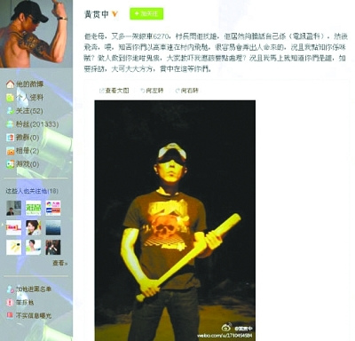

黄贯中在微博爆出的照片

Beyond乐队成员黄贯中(Paul)近日在微博表示被不明来历的车跟踪返寓所，令他感到受骚扰，还在微博爆出拿着棒球棍的照片。

3日，记者致电Paul，他生气地说：“我同朱茵下午外出买菜，就已经开始跟，回到大埔住所，又见到不明来历的车停在附近。我上前那辆车即刻开车，十分钟后又停过来另一辆车。村长上前问，对方竟然说是电讯公司，然后开飞车走了。滋扰到我同其他村民已经不对，还要开飞车，好多小孩和老人家，非常危险！”之后Paul拿着棒球棍在屋外等，他说：“我又不是花花公子在周围逛夜店认识女孩子，为什么这样针对我太过分，而且好没有水准。”
