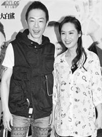

乐队Beyond成员黄贯中性格不平则鸣，前晚他在微博表示被不明来历的车跟踪返寓所，令他感到受骚扰，之后还在微博爆拿着棒球棍拍照。

昨日记者致电给Paul，他生气地说：“我同朱茵下午外出买菜，就已经开始跟，回到大埔我的住所，又见到不明来历的车停在附近。我上前那辆车即刻开车，十分钟后又停过来另一辆车，这次村长上前问，对方竟然说自己是电讯公司，然后开飞车走了。他们滋扰到我同其他村民已经不对，还要开飞车，这个村好多小孩和老人家，非常危险！ ”

之后Paul叫朱茵自行回家，Paul就拿着棒球棍在屋外等，他说：“我又不是花花公子在周围逛夜店认识女孩子，为什么这样针对我太过分，而且好没有水准。 ”
