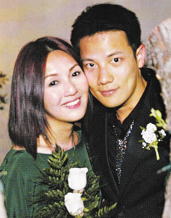

杨千嬅、丁子高

据香港媒体报道，丁子高与黄贯中同样是准龙爸，4月18日他恭喜黄贯中说：“恭喜他们，我想他慢慢就像我一样越来越紧张，大家都是第一次做爸爸，很多事都不会、都要学，我觉得他会处理好的，会是一个好爸爸。”

即将荣升“龙爸”的丁子高近日出席时装活动时，他透露老婆杨千嬅的预产期在六月，但因腹中的宝宝长大速度太快，可能要提前两星期剖腹产子，所以宝宝有机会在下月抢先出世，届时丁子高还可能亲手为宝宝剪脐带，不怕血的他表示觉得脐带是内脏，现在心理上还没准备好。“我现在不停地上网看生孩子的视频热身，能接受生孩子的画面，届时也会拍片。她对我剪不剪脐带也无所谓，最重要的是我陪她进产房，之后保留宝宝的脐带血。”丁子高还透露等老婆入院后会立刻为宝宝的房间动工，5天后完成装修。
