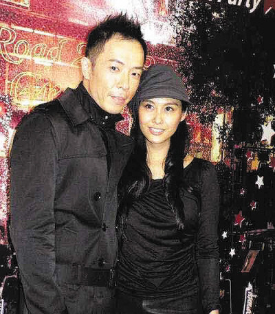

黄贯中、朱茵

近日，黄贯中与朱茵一同返港，宣布有喜，并于明年完婚。而后，查小欣在自己的专栏中透露与黄贯中的通话内容，黄贯中称朱茵怀孕过程很舒服，没呕没晕，也没长肥。对于得知要做爸爸这个事情他表示很意外，并感动到落泪。

## 专栏部分原文

黄贯中讲了很多没有披露的事情，他回忆上周跟我的一通电话：“就是跟你挂线后便知道了，朱茵告诉我‘你快做爸爸了’，我的第一反应是呆了几秒才懂得反应。”朱茵感动又开心，不住地流泪，黄贯中则兴奋地跟朱茵拥抱。

甜到爆的黄贯中透露朱茵怀孕过程很舒服，没呕没晕，也没长肥，“肚皮也没隆起，所以意外怀孕近3个月才知道。”

暂时朱茵最大的生理变化是食量很大，“她每小时都要吃东西，而且吃很多，口味天天不同。今天要吃鸡就一定要吃鸡，不可以吃其他东西代替；第二日她已转了口味，要吃羊……我又四处为她搜罗，可以说疲于奔命。不过我不介意，我一向都是这样照顾她的，早已习惯了。”黄贯中深情地说。

至于想生儿子还是女儿？黄贯中说：“无所谓，最重要是健康。”

黄贯中养有多头西藏獒犬，他说初期不会让宝宝接触身形庞大的西藏獒犬，“可以肯定的是他们定能成为朋友。
