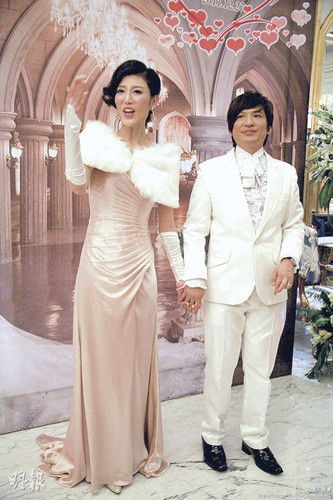

图片来源：香港“明报”

中新网4月22日电

香港“明报”报道，48岁的叶世荣昨晚于北京接受媒体访问时，宣布太太张伟铃怀孕喜讯，自己也将与另一位Beyond成员黄贯中齐齐等候做“龙爸”。叶世荣与太太去年12月结婚，终于造人成功。

Beyond三位成员以黄家强最早结婚及做爸爸，他的第二名儿子于今年2月出世，率先做“龙爸”。黄贯中则于日前宣布女友朱茵 怀孕3个月，计划年底结婚。昨晚轮到叶世荣，令粉丝开心，并希望他与黄贯中都生儿子，将来他们的儿子可以再组乐队。
