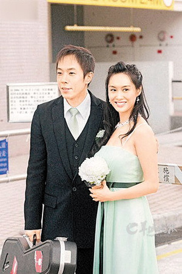
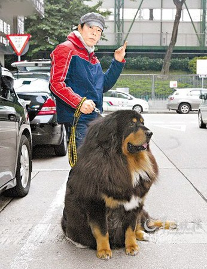
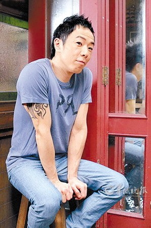

黄贯中与朱茵双喜临门

现年48岁的黄贯中(阿Paul)年底将跟相恋14年的女友朱茵拉埋天窗，他们的宝宝的预产期则是今年11月，可谓双喜临门。被贬为“穷Paul”的他为求女友嫁得“得体”，将赠送巨钻兼搞“梦幻狗婚礼”。黄贯中接受香港媒体采访时称：“打算做完红馆演唱会后，年底就和朱茵结婚，希望Ada(经纪人)给我时间筹备婚礼。阿茵也和我谈过结婚的事，现在还没定下来是在香港还是在国外摆酒，但她不想铺张，因为怕麻烦。但我觉得终身大事一定要办得好看。”

## 梦想的婚礼 | 阳光沙滩狗狗钻戒

谈到婚礼细节，黄贯中说：“有朋友告诉我，阿茵的梦想婚礼要有阳光、海滩，如果她想在沙滩结婚，那会选择去国外办。这让我挺头痛，因为请一大批亲戚朋友过去要花不少旅费。本来我想过到时让刚出世的宝宝做花童，不过有人提出不如让我们的狗狗做‘花童’。我觉得这个提议不错，阿茵最喜欢她的狗狗了。”

黄贯中还透露，他已存了一笔钱买钻戒，“说实话，两个人在一起最重要的是开心，所有的仪式、物质条件都没那么重要，但我认为买结婚戒指是不能图省钱的。我起码会买个价值几十万元的戒指，现在已经存了一笔钱，但数目不算很大，希望趁着还有时间，努力赚钱买大钻戒。”

## 腹中的孩子 | 开始考虑教育问题

谈到朱茵腹中的孩子，黄贯中显得颇为得意：“阿茵虽然属高龄产妇(40岁)，但我完全不担心她的健康。医生看得很紧，每个月都要做产检。我跟医生说，需要做的检查，不管多贵，要花多少钱，全部都帮我们做好。记得第一次跟阿茵去做产检，可以透视看到宝宝，我当时就看傻了。宝宝好小啊，看到他的头、手，有种很奇妙的感觉，心想这就是我跟阿茵的结晶？第二次产检，可以看到他已经有小眼睛了。最近一次产检，还看到宝宝用手捂着耳朵，很可爱。”

宝宝还没出世，黄贯中就添了许多烦恼：“宝宝的名字我还没有想好，等阿茵生了以后才决定，但我肯定会陪阿茵入产房，还准备帮宝宝剪脐带。以后教育小孩，我会扮演‘坏人’一方。其实生男、生女都麻烦，生儿子要担心他以后变坏。生女儿更麻烦，我怀疑自己会变成‘吃醋的岳父’，有男同学打电话来找女儿问功课，我就会骂他：‘什么功课呀？问我啦！’、‘你为什么有文身？’但阿茵很喜欢孩子，还问我要不要多生几个。”

黄贯中想让爱犬当婚礼花童

## 曲折求爱路 | 装帅气不敢看朱茵

黄贯中一向敢于冒险，但面对朱茵却一再错过机会，等足12年才向朱茵展开攻势。黄贯中称：“我跟朱茵拍拖14年，好多人以为我们是进入娱乐圈才认识，其实我们的第一次邂逅，是我跟其他乐手去她读的香港演艺学院表演。第一次见到她，我就跟身边的乐手说：‘你4点钟方位的那个女孩子好漂亮啊。’但我要扮型男，所以没有正眼看她一眼就离开了。”

## 近水楼台却没胆追

其后，黄贯中与朱茵成了邻居，但他没有“近水楼台先得月”的勇气。“10年后，阿茵刚好住在我楼上，我们做了两年半邻居。当时我已经对阿茵很有好感，但没有胆量去认识她。我们经常在大厦大堂碰到，有时还会搭同一台电梯，但每次我跟她搭同一部电梯的时候都表现得好傻，会全程望着电梯的楼层显示屏，脑子不停想：‘啊，美女呀，我好想看，但不能看呀，要忍住。我那么帅，不要吞口水那么猥琐呀。’”

## 第一场约会就被拍

后来，黄贯中终于鼓起勇气约朱茵，但第一次约会就被媒体发现了。“在准备搬家前，我才鼓起勇气约阿茵上街。当时我打电话问她有没有兴趣一齐去看狗展，她答应了。怎知我跟她的第一次约会，手都没牵就被记者拍下照片。唱片公司高层还因此把我叫回公司，虽然没有骂我，但很严厉地向我‘了解’情况。”

两人拍拖后，黄贯中才知道朱茵也留意他很久了。“阿茵说她未入行前已很欣赏我，我不相信，她就拿出两张照片给我看，一张是她在高山剧场门口拍的照片，相中的我好像路人甲那样走过，她假装是跟我拍合照。另一张更傻，她竟然挨在电视荧屏旁，跟电视节目中的我合照。不过阿茵不是我的粉丝，她最喜欢的是达明一派的明哥(黄耀明)。幸好明哥是同性恋者，不然我就没有机会了。”
