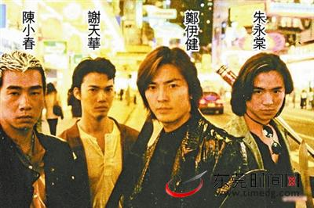

《古惑仔》剧照

据港媒报道，今年连续有多部港片叫好叫座，刺激导演王晶也加入力撑港片，计划连开四部土产港片扶持新导演和新偶像，头炮是重拍当年极受欢迎的《古惑仔》系列电影。王晶钦点TVB新宠肌肉男罗仲谦演陈浩南、梁烈唯演山鸡、黄贯中(Paul)饰演陈浩南恩师大佬B、沈震轩演靓坤、林子善演包皮。

王晶与文隽监制、刘伟强执导的《古惑仔》电影，改编自牛佬的同名漫画，于1996年上映时成绩斐然，接连开拍了六部系列电影，掀起香港影坛的江湖片热潮，同时在片中饰演男主角陈浩南的郑伊健，也凭这部戏登事业高峰。

如今新版《古惑仔》由王晶公司“最佳拍档”出品，预计十月初即开拍。王晶接受采访时表示，新版《古惑仔》会沿用旧版故事，但细节剧情会有新改动，起用年轻班底就是为了给故事注入新鲜血液，而旧版中由黎姿所演的小结巴一角，只会在新版第二部出现，其人选还在挑选中。
