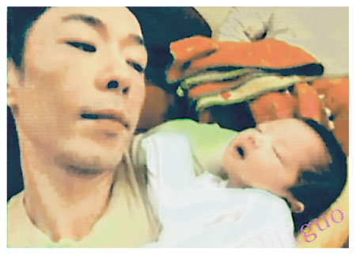
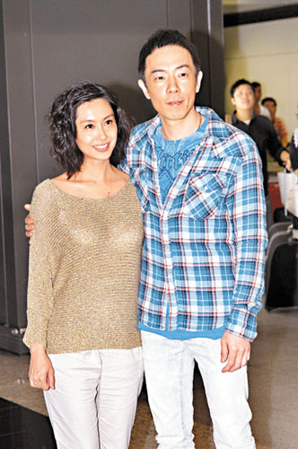

图片来源：香港“明报”

中新网10月30日电

香港“明报”报道，黄贯中(Paul)与朱茵的爱女“叉烧包”日前出生，初为人父的黄贯中充满喜悦，前晚接受某节目访问，公开自己抱着女儿的照片。

黄贯中表示还没为女儿改名，正收集家人的意见。他拒透露女儿的出生日期，因自己父母叮嘱八字要保密。问到女儿像谁？黄贯中称很多人都说更像他，朱茵则说像他不好。

黄贯中又赞朱茵怀孕期间体型变化不大，只重了 20磅左右；不过女人都爱美，只能等恢复到最佳状态才会出来见人。

图片来源：香港“明报”

图片来源：香港“明报”

图片来源：香港“明报”

朱茵、黄贯中 图片来源：香港“文汇报”
