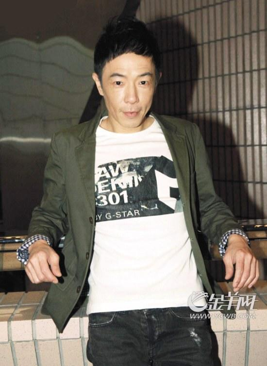

齐秦和黄贯中PK、羽泉对阵尚雯婕……这是湖南卫视今年最新节目《我是歌手》的“对决”。两周前导演洪涛就曾公开宣布将会有7名神秘的圈内大牌歌手加盟这档新节目，为冠军的头衔白刃相见，但当记者现场见证这个谜底真正揭开时，还是为齐秦、黄贯中、羽泉、尚雯婕、陈明、沙宝亮、黄琦珊这份阵容名单兴奋了一把。前日记者探班节目录制现场，刚刚被浙江卫视“遗忘在后台”的黄贯中以及烧伤后复出的齐秦等人均接受了记者的采访。据悉，第一期节目将于1月18日晚开播。

刚被“遗忘”的黄贯中，这么快就投奔了湖南卫视，这难道是一次有预谋的邀请和加盟？不过当事双方均对此进行了否认，称半个月之前就已经达成了加盟协议，这一举动的背后并没有太多“内涵”。被问及那天被遗忘在后台的事，黄贯中一脸笑容说：“这件事情对我本人来说没什么，当时有什么的是我的乐队兄弟和我的经纪公司，对我来说这件事情已经过去，大家以后依然可以合作。另外你知道吗？我觉得这种体验还蛮新鲜的，那种你上台的时候观众都走了，然后你开唱，观众又全回来了的感觉，哈哈，很奇妙，以前从来没有这样过。”

黄贯中和妻子朱茵是一对圈内著名的神仙眷侣，网上更是流传着两人赤裸上身甜蜜相拥的温馨照片，记者现场提到那张照片时，特别问黄贯中身上有多少道文身，黄贯中说：“其实我身上只有一个文身，就是五条龙，从肩膀到手臂，已经文了20多年了。这个文身后面的确有个故事，以前家驹在的时候，他很喜欢文身，但那个时代文身还不流行，我们都觉得不好，所以一直不准他去，结果他一定要去，我就说那我来帮你画吧。所以那时候他身上的文身都是我画的。我记得他经常指着手臂对我说，‘来，这里画个骷髅’之类的话，文完之后就很开心。后来家驹走了，我就觉得需要做点什么事情来纪念他，所以他走后，我在第一个生日的时候去文了龙，算是送给自己的礼物。”记者易哲
