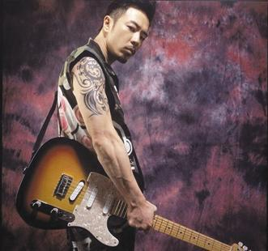

黄贯中

如果不是跨年夜被主办方遗忘在后台，黄贯中很难登上娱乐头条。多年来保持低调的他，在人们印象中，只是曾经辉煌过的乐队Beyond的吉他手，女星朱茵的老公。这一次的事件，让黄贯中从“被遗忘”变成“被追访”，前晚他亮相湖南卫视新节目《我是歌手》的录制现场，成为最具关注度的明星。

面对媒体，黄贯中首度开腔回应说“没有一直介意这件事”，他还表示要感谢这样特别的经历，因为当他看到已经离开的观众被他的音乐吸引回来时，他收获的是感动。

## 被遗忘的歌手 | 感谢特别的经历

新年第一天，“遗忘黄贯中”风波就霸占了娱乐头条，浙江卫视、星空卫视和灿星公司为“黄贯中究竟被谁遗忘”一事简直是“剪不断理还乱”。最终，星空卫视向黄贯中发出道歉声明，并给出完整的解释。“这不是我要烦恼的事，我也没有要求他们道歉。”首度开腔的黄贯中，称受到伤害的是观众，而事件如何处理都是经纪公司和主办方之间的事，他本人不会计较和介意。“每次只要有演出，我就努力地去表演，演到100分。演出完我会带着兴奋的心情回去好好睡一觉，就这么简单。”

黄贯中还说，他反而要感谢这一次的突发状况：“这么多年我从来没有试过这种，就是看到观众已经离开，我一边弹他们一边走回来，那种感觉很特别，很感动。反而我应该说谢谢才对，可以在舞台上感受这种经历。”

## 九龙文身的男人 | 只为纪念黄家驹

“原谅我这一生不羁放纵爱自由，也会怕有一天会跌倒……”在《我是歌手》的舞台上，黄贯中唱起了Beyond的金曲《海阔天空》，一曲唱毕，他眼圈微微泛红。“我每次唱这首歌都会有一种很奇怪的感觉。”黄贯中说，那一刻他仿佛回到了演唱会上，心里百味杂陈，久久不能平复。

回忆过去，当提到已离开人世许久的黄家驹时，黄贯中说起了他右臂九龙文身的故事。“这是在家驹去世后，我送给自己的一个生日礼物。”以前黄家驹很想要一个文身，却被乐队成员阻止，黄贯中为了哄他，就会在每次演唱会前帮他画一个文身。黄家驹意外身亡，让黄贯中觉得有些事情应该想做就做，“所以我马上弄了一个文身给自己，作为纪念。”特派记者肖黎
