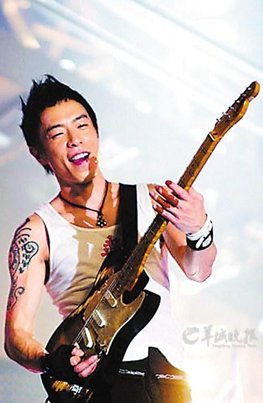

黄贯中

我们总嗟叹歌坛不景气，歌手无好歌，但我们缺的不仅是好声音、好音乐，更是黄贯中这种“简单”的好歌手。

黄贯中可能也没想到，自己竟在2013年的年头大大地火了一把，而且是以“被遗忘”的方式。他在观众开始撤离、工作人员撤场的情况下，依然坚持登台，抱起吉他与乐队唱了整整十首歌。

我承认，“过气歌手真悲哀”的念头曾从脑中一闪而过。因为看到电视台和制作公司互相推诿责任，出于职业习惯，我曾到处打听黄贯中的联系方式，想听这个“倒霉蛋”讲讲那天晚上到底发生了什么事。结果，打出去的电话全部石沉大海，A说：“黄贯中是谁？”B说：“倒是见过他，但从来没想过要他的电话。”

1月3日，听说黄贯中将参加《我是歌手》的录制，很多同行摩拳擦掌，有的已准备发一个以“黄贯中炮轰某卫视”为眉题的大稿子，黄贯中俨然成为超越羽·泉、尚雯婕、齐秦等当日同台歌手的头号Superstar。节目总导演和工作人员则一再尴尬请求，“我们和黄贯中的合作几个礼拜前已经定下，请各位手下留情，不要令歌手难堪，也不要制造与友台的矛盾……”

然而在采访完黄贯中后，我却感到无比惭愧。没有想象中的“炮轰”、“怒斥”，也没有导演组担心的拂袖走人，被问到跨年夜“被遗忘”的事情，这个在台上可以将嘶吼、愤怒挥洒得淋漓尽致的Rocker却笑得无比祥和。他说，道歉、问责不是我该操心的事，我就是只要有舞台让我唱，我就去，唱到一百分，然后带着兴奋的心情回家好好睡一觉，就这么简单。

是的，就这么简单，痴痴地听完他唱的一曲《海阔天空》，看到他带着满额细密汗珠、一脸认真接受记者采访，我开始理解他为什么可以在被遗忘的情况下依然选择登台演唱。经历过巅峰、低谷、被遗忘，他之所以还站在舞台上，就是因为那句“不玩音乐我会死”。

我们总嗟叹歌坛不景气，歌手无好歌，但我们缺的不仅是好声音、好音乐，更是这种“简单”的好歌手。黄贯中说，他想表达愤怒或激动的情绪时，还是会有写歌的习惯；反观如今的选秀歌手，一个个声泪俱下地述说自己未了的音乐梦，却在一转身走红之后，拿着令人咂舌的高额出场费，安然翻唱着别人的歌曲。我在采访后与朋友感叹：什么叫真歌手？看看黄贯中就知道。

人在江湖飘，哪能不挨刀
