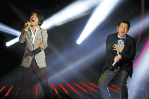

两期节目最令观众诟病的是演唱之外“零碎”太多

湖南卫视《我是歌手》昨晚播出第二期，上周遗留的谁出局的悬念揭晓——黄贯中意外被淘汰。上期“一鸣惊人”的黄绮珊再次展示惊人实力，以一曲《离不开你》博得全场欢呼升至排名第二，而羽·泉也凭借《烛光里的妈妈》催泪的曲调排名升至第一。

黄贯中的被淘汰，和先前的传闻严重吻合，意外也不意外，其演唱的摇滚版《吻别》创新性不足，难以引起共鸣。他的位置将由杨宗纬取代，下一期与留下的歌手展开PK。不过，不少网友不满黄贯中的出局，尤其是他上周排位第三，这周排位第七，却被两周排名第七、第六的陈明比了下去，让人大呼有“黑幕”。几乎让观众众口一词不满的是导演组在宣布歌手排位时，故弄玄虚，生生把几秒钟能公布的排位拉到20分钟，做戏效果太过。

因为昨晚第二期排位赛中将有一位歌手离开，因此节目中画面也重点烘托选手的紧张。比如，黄绮珊出场前，镜头一直对着她拿麦克风的手，手指有点僵硬地敲动麦克，诸如此类渲染的镜头频频出现，而观众席上则经常闪过一张张带泪的脸，尤其是羽·泉演唱《烛光里的妈妈》时，不少人都听哭了，仿佛一场大型公益晚会。

在首期中，齐秦、尚雯婕、黄绮珊、黄贯中、陈明、羽·泉、沙宝亮分别演唱了自己的代表作，而根据赛制，第二期节目中，他们将不能演唱自己的作品，需改编一首其他歌手的作品进行翻唱。齐秦演唱了《用心良苦》、陈明演唱了《当我想你的时候》、沙宝亮演唱了《秋意浓》、尚雯婕演唱了《你怎么舍得我难过》。

在7位歌手演唱结束后，选手的排名与上期相比出现了大逆转，上周冠军齐秦落到第五，羽·泉升为第一，上周名列第六的黄绮珊绝地反击，升到第二；尚雯婕依旧在中游，而上周获得第三的黄贯中却不幸垫底，最终因综合票数最低遗憾离场。黄贯中倒是显出一副大气的模样，他表示来参加节目很开心，名次并不重要，自己回到香港后，会告诉朋友们自己参加了一个很好玩的音乐节目，也希望其他人来参与。黄贯中淡然的表情和真诚的告别赢得了歌迷的称赞，还有不少人为他遗憾，“家驹曾经说过，香港没有音乐，只有娱乐圈，现在我看来内地也一样，在我们心目中黄贯中永远第一，希望黄贯中带着Beyond打不死的精神一直走下去。”一位网友评论道。

《我是歌手》播出两期以来，最让观众诟病的是开头VCR的过多出现以及宣布排位时的故意拖长。微博上有网友评论，节目的前15分钟可以不看，全是对歌手在场外状态的展现，冗长而无趣。在主持人简单串场时，也被认为话太多，和《中国好声音》相比，不禁让人想起“好舌头”华少的利索，不浪费一点时间。虽然整场节目除去广告外只有不到100分钟，但基本呈现“蛇头蛇尾”的结构，到了最后20分钟，竟然全是宣布比赛排位，观众投票后退席，场内只留下7位歌手和“经纪人”排排坐，一位穿着工作服的总导演煞有介事地公布名次，他从第四位公布起，全部打乱次序，并让歌手们猜测自己的名次，直到最后从剩下的三人中宣布黄贯中被淘汰。这种公布方式让观众大呼“伤不起”，“芒果台你能再磨叽点吗，直接念出名次能死啊”，“我是歌手宣布排位简直比便秘还难受，齐秦、黄绮珊一直是一副苦大仇深的表情，能别这么折腾人了吗”。
