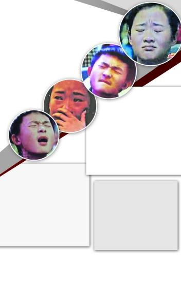

“哭泣姐”、“表情帝”的各种投入，各种表情。

去年夏天《中国好声音》的成功，让大家再次感受到音乐的魔力。近日，湖南卫视全新打造的重磅音乐节目《我是歌手》在2013开年就引发了一场音乐热潮。对于这种让歌坛实力唱将同台比拼的节目，就如杜海涛所说：“它不再是草根选秀，比赛的意味也并不重，歌手们仅仅单纯地用声音感动着观众。”随着第二期的播出，节目的关注度也越来越高：歌手真不知道对手是谁？参赛歌手做主持如何淘汰？“哭泣姐”是不是托儿？网友们也开始对节目产生众多质疑，就连去年火爆一夏的《中国好声音》，也炮轰《我是歌手》玩煽情，表演成分过多。

## 疑问1 歌手真不知道对手是谁？

《我是歌手》在节目设置上做足了神秘感，由芒果名嘴组成的经纪人团队和歌手们进行配对并且并肩作战，这个环节引来了众多网友的吐槽觉得很假。网友“古灵精怪”说：“黄绮珊出场的时候，维嘉那惊讶的表情，未免有点太过了，我觉得他也很可能之前就不认识黄绮珊。还有，我才不信歌手之前不知道都有谁会参加，自己的对手是谁。”针对这一点，舞美师也称：“整个节目都在多线条多角度地集中营造一种紧张神秘专业真实的气场。”

## 回应1 | 尚雯婕看到黄绮珊出场“后悔”参赛

节目组宣传人员告诉记者：“我们在安排艺人录节目之前不会告诉他们艺人都有谁，七组艺人被我们安排在不同的七个酒店，由七个团队来分别负责。上场前他们也不会从节目组了解到对手是谁，只会准备自己的表演。”而对于这一点歌手们也给予了肯定，沙宝亮在接受记者采访时说：“之前确实不知道对手都是谁，以前参加节目都很自由，这次连去卫生间都要报告一下，被允许了才能去。老实讲很多年都没有这种紧张感了，既紧张又很过瘾。”此外，尚雯婕也说：“我唱完一看她(黄绮珊)来了，我瞬间觉得压力特别大，因为她唱得确实非常棒，早知道这样我可能就不敢来了。”

## 疑问2 黄贯中遭淘汰有黑幕？

1月25日的淘汰赛中，黄贯中被安排演唱张学友的经典名曲《吻别》，听惯了学友那种温柔细腻风格的演唱，再听黄贯中略带粗犷的演唱，观众难免不习惯。面对如此冒险的选歌方式，黄贯中最终也尝到了“苦果”。第一周排名第三的他沦落到第七，惜别舞台。

据了解，此前朱茵曾鼓励黄贯中来到《我是歌手》，目的是为了挫挫他的傲气，但没想到老公居然是第一位就离开的歌手。对于当晚的结果，让观众、网友不解的是，黄贯中第三名和第七名的综合名次，居然会不敌两次排名分别是第七名、第六名的陈明，于是纷纷要求公开具体票数，以示公正。

## 回应2 | 导演表态：下周他还来

在歌迷和朋友为黄贯中的率先离场抱不平时，他反而劝慰他们，希望他们冷静，表示赞许反而令自己迷失，责怪别人不能令自己更强。黄贯中在27日凌晨的微博中写道：“音乐没有所谓公不公平的，只有个性，或许‘摇滚’是邀我参与的原因，同时也是淘汰我的原因，不要以为我在气话(若知道我有多爱音乐的话)。所以赞许反而令我更迷失，我能输了比赛但却不能输了方向。希望其他歌手加油，别让支持你们的人失望，别让我尴尬。只想朋友冷静，因责怪任何人不会令我更强。”昨天下午，总导演洪涛告诉记者，下周黄贯中将作为“返场歌手”再次站上这个舞台，带来赵传的《我终于失去了你》。

## 疑问3 “哭泣姐”“表情帝”都是托儿？

第二期比赛许多歌手都以抒情歌曲为主，现场的两位观众也因此成了亮点。其中一位被称做“哭泣姐”的女观众被发现当羽·泉唱《烛光里的妈妈》时她哭，当齐秦唱《用心良苦》时她哭，当陈明唱《当我想你的时候》时她哭，当黄贯中唱《吻别》时她哭，当沙宝亮唱《秋意浓》时她哭，当黄绮珊唱《离不开你》时她哭，当尚雯婕唱《你怎么舍得我难过》时她哭。另外一位男观众的表情则更加销魂，多次镜头中切换到他，他总是一副很纠结的表情。对于这两位观众许多网友又开始质疑是否是请来的。

## 回应3 | 导演澄清：“是真实反应”

面对让人生疑的观众，也有网友认为这是镜头剪辑的效果，不足为奇。“我在现场也经常看到观众哭，甚至也多次询问其为何，他们的回答是现场音效真的很好，令人很投入。”总导演洪涛回应说，节目中观众的表情全是真实反应。“不仅是表情，包括掌声等，我们都不会让镜头移花接木。”洪涛表示，500名听审团报名后，需要接受统一的乐理知识考试和面试才获得评委资格的。
