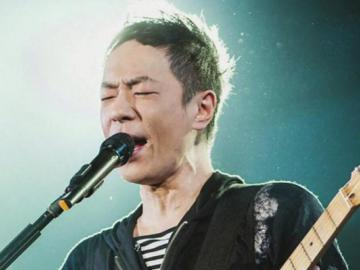
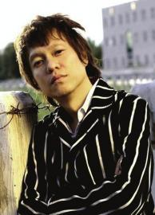
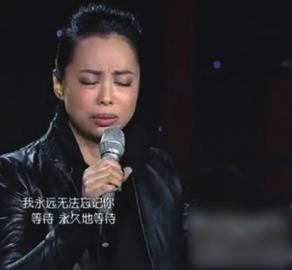
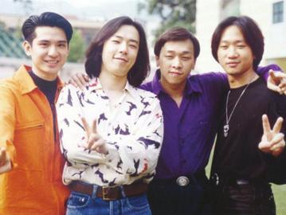

黄贯中改编的摇滚版《吻别》让人耳目一新。

梁翘柏是节目的灵魂。

黄绮珊是最大的惊喜。

Beyond乐队昔日光辉，代表一代人永远的青春。

黄贯中追不回“光辉岁月”音乐总监：赢者未必比他好

首次引进专业歌手同台PK，成为节目最大看点，不过也造成粉丝骂战。

包括观众投票、歌曲选择等方面都成为质疑点。

更具话题的是，《中国好声音》节目组也指出《我是歌手》的节目弱点，两大王牌歌唱节目火药味十足。

@华西都市报：

好声音的余温刚刚冷却，没想到《我是歌手》又成为话题节目。上周黄贯中被淘汰，引发歌迷反弹。昨日华西都市报记者采访节目音乐总监梁翘柏，一番话或许可以释怀：第一名也未必比黄贯中唱得好。

## 人物简介 | 梁翘柏是谁

在幕前，梁翘柏曾是上世纪80年代香港乐团浮世绘的灵魂人物，现在他则是一名创作歌手；在幕后，梁翘柏是王菲、陈奕迅、周笔畅、容祖儿、陈慧琳、许志安、杨千女华、蔡琴、陈坤、李克勤、卢巧音、何洁、李霄云等歌手的唱片监制、作曲与编曲人，甚至创作“2008奥运”候选主题曲。

湖南卫视《我是歌手》才播出两期，再次延续歌唱类节目高收视。将齐秦、羽凡、陈明、尚雯婕等大牌歌手凑到一起唱歌PK，谁输面子上也挂不住，究竟什么吸引力让他们站上PK台。

幕后大牌浮出水面，正是节目的音乐总监，香港知名音乐人梁翘柏。昨天华西都市报记者独家专访他。

## 改编给尚雯婕配把二胡

出任音乐总监，梁翘柏除负责整个节目的现场音乐，还要为歌手改编歌曲。大家都是专业歌手，梁翘柏说，“我会给他们建议，什么样的改编类型适合他们。因为音乐一定是需要新鲜感，如果一成不变翻唱，肯定会很吃亏。”为了增加歌手们音乐的多样性，梁翘柏还特地将许多不常见的乐器加入当中：“首先是在节目中，希望能用他们的演奏，舒缓整个歌曲的节奏。另外一些不常见的乐器会加入。比如在第一期节目中的二胡，编钟之类的，能给观众带来新鲜感。”

节目中梁翘柏为歌手们担任着军师，但在他看来，既然来参加节目，就应该把歌曲改编得更合理：“我觉得输赢是一个很重要的出发点，既然是来参加节目，那一些规则必须要遵循。所以到底是为了好玩而改编，还是为了展现自己的实力，我会给他们建议。如果为了好玩，那可以在自己的演唱会，或者表演的时候。”

## 评委没一个音乐人敢来当

观众投票遭到歌迷诟病，认为这样对歌手不公平。记者提出如果梁翘柏来当评委，怎么样评定自己淘汰谁？没想到梁翘柏连说几个“不”字，他觉得没有一个音乐人敢来当评委：“所有人都是专业歌手，你怎么评？大家唱法不同，适合的曲风也不同，不能用一首歌就来评判，所以我想没有一个所谓的专业音乐人敢来当评委，反而交给观众是最合适的，因为他们完全是凭自己听歌时候的想法，比如有的人哭了，有的人笑了，这很真实。我也觉得只有让观众来投票，才是最合适的。”

黄贯中遭淘汰引发歌迷反弹，梁翘柏则安慰：“不见得第一名就唱得比黄贯中好呀！歌手现场发挥有很多影响因素，比如心情、嗓子情况，又或者他早上看了一篇报道，都可能受影响。我觉得这就是一个没有答案的问题，输赢很重要，但是只要大家在舞台上享受了音乐，就可以了。其他的都是不可能控制的。”

## 有黑幕？别了，我们的“粤语老师”

上周五《我是歌手》第二期播出，黄贯中成为首个被淘汰的歌手，引发歌迷强烈反弹，认为节目不公正。

在之前节目中，黄贯中以Beyond乐队的经典曲目《海阔天空》排名第三，陈明则由于身体状况发挥失常，导致名列最后。上周淘汰赛进行，每个歌手都拿出看家本领。黄贯中再度展现摇滚精神，将张学友的金曲《吻别》改编成摇滚版，但没有得到现场观众的喜欢，成为得票最少的歌手。虽然陈明的表现也并不算好，排名第六，但根据两场最终累计得票，黄贯中票数最低惨遭淘汰。

赛后引发歌迷反弹，于是观众将矛头直指观众投票这一环节，认为票数统计不够透明，也有网友认为，尽管电视最后公布了两场得票数，但镜头一晃而过，完全看不清楚。不过节目组也回应，称投票完全公正。观众特意选择多个年龄层，还有现场监票人员。

## 在掐架作秀？“好声音”指责“歌手”

为了对抗新一季的《中国好声音》，今年湖南卫视一口气推出三大歌唱节目，分别在前三季无缝播出，一口气抢收视。从目前播出两期的收视率看，《我是歌手》大有希望领跑第一季。

不过前两天在接受采访时，《中国好声音》宣传总监陆伟罕见地对《我是歌手》发表看法，并直指节目表演成分太多，陆伟说：“明星们已经很懂得怎么面对镜头了，如果不把他们‘逼’到一定的份上，他们的表情和动作总让人觉得有点表演的成分。但是‘好声音’的学员以前不太面对镜头，观众会看到他们的各种自然真实情绪。”

同时陆伟还指出节目的致命弱点：“如何操作综艺节目，湖南卫视向来很拿手，但是在真人秀运作方面则不太成熟。他们将那些综艺化元素运作在真人秀方面，犯了真人秀的大忌。”隔空对话，显得火药味相当重。

## 往事 | 王菲录歌录到崩溃

熟悉梁翘柏的歌迷都知道，除了为王菲、陈奕迅、陈慧琳等歌手制作专辑，梁翘柏也在音乐中尝试诸多前卫曲风。包括王菲经典作品《光之翼》、《夜会》等都出自梁翘柏之手，说起与王菲合作，他说王菲唱到崩溃。

“阿菲对于歌曲的接受度很大，除了歌词她会提出自己的意见，曲方面一般都不会。我的习惯是在录副歌部分，会让歌手一直唱，唱十几二十遍。那次阿菲也是一直唱、一直唱，最后唱得崩溃，直接说：‘还没好呀，到底要怎么唱呀！’”

我也希望歌手们不管是录音还是唱现场，都可以玩一些创新的编曲：“唱歌是把自己的情绪，享受的音乐唱出来。我倒建议歌手们不要为了迎合观众评委，而去唱一些不适合他们的歌曲，最重要是适合自己，让自己享受舞台和音乐。”

## 有回音 | 歌手咸鱼翻身 演出公司怕涨价

随着《我是歌手》收视率不断攀升，参加节目的歌手也从“白粥”，一跃成为眼下最受关注的炸子鸡。昨天在网络上也流传一份演出中介公司的调侃内容，希望歌手们在节目结束后不要乱涨价，不然目前报给各个公司的价格又要重写。

不过从目前的收视率和引发的关注来看，歌手们涨价几乎已成定局。从以往的经验来看，快女、《中国好声音》等节目热播后，除了捧出新歌手之外，最大的受惠者非评委莫属。柯以敏、巫启贤、朱桦、杨坤等人全部鲤鱼跃龙门，在节目当红时，出场价翻倍。此次参加《我是歌手》节目中，黄绮珊无疑是目前最受欢迎的歌手之一，而陈明、沙宝亮、齐秦等歌手本来就有价有市。节目结束后，携节目创下的影响力，出场费必定会再次上涨。

## 立即评 | 没来的歌手后悔去吧

《我是歌手》最大的看点就是把各位专业级歌手放在一起PK，谁输了首先这个面子就掉不起，所以能来参加这个节目，不妨各位看客们先给歌手们鼓鼓掌。就像梁翘柏说的一样，这件事情太困难了，困难到以至于没有哪个音乐人敢来接评委这个工作。你试试批评黄绮珊、陈明、齐秦：“我觉得你唱歌时太用力”、“感情不到位”……我想不翻你个白眼，已经算是对你客气了。来参加节目的歌手也很清楚，大家要的就是唱歌时的快乐，输或者赢只要不伤了和气，一切都好谈。虽然歌迷为黄贯中愤愤不平，不过或许人家一开始就放下了。我相信除了大家现在看到的这些歌手外，节目组肯定也邀请了其他歌手，拒绝的肯定有。节目红了，收视高了，身价涨了，输赢真的有那么重要吗？没来的歌手们，慢慢后悔去吧。华西都市报记者任翔
