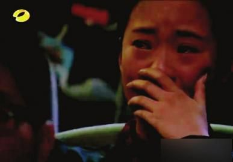
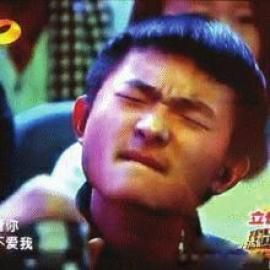
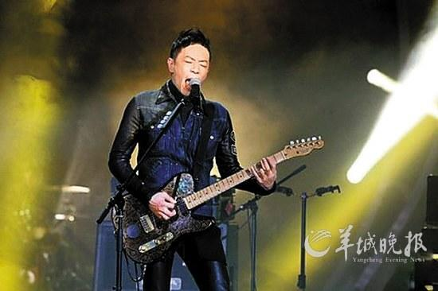

据《新浪娱乐》，《华西都市报》

哭泣姐

陶醉哥

黄贯中

25日晚，芒果台的《我是歌手》再战一场，在上周排名第三位的黄贯中因选曲不利，不幸被听审团踢出局，成为首位离开《我是歌手》的唱将。

对于这样的结果，网友提出质疑。此外，节目中频繁出现的“哭泣姐”“陶醉哥”也引发观众大讨论，“难道这些都是专门负责煽情的托儿？”日前，总导演洪涛接受记者采访时表示，观众表情全部都是现场的真实反应，节目不允许移花接木的镜头掺杂其中。此外，洪涛还透露，黄贯中下周将作为“返场歌手”再次站上舞台。

## 黄贯中为何遭淘汰？ | 导演回应：下周他还来

黄贯中当晚以经典曲目《吻别》出场。面对如此冒险的选歌方式，黄贯中最终也尝到了“苦果”。上周排名第三的他沦落到第七，惜别舞台。据了解，此前朱茵曾鼓励黄贯中来到《我是歌手》，目的是为了挫挫他的傲气，但没想到老公居然是第一位就离开的歌手。而他本人昨日也在微博上写下了参赛以来的感受，“很多东西我不是不知道它不会来，只是没想到它来得那么早而已……”

对于当晚的结果，让观众、网友不解的是，黄贯中第三名和第七名的综合名次，居然会不敌两次排名分别是第七名、第六名的陈明，于是纷纷要求公开具体票数，以示公正。昨天下午，总导演洪涛告诉记者，下周黄贯中将作为“返场歌手”再次站上这个舞台，而他带来的最后一首歌是赵传的《我终于失去了你》。

## 观众被疑是托儿？ | 导演澄清：“是真实反应”

“《我是歌手》里最让我受不了的是观众，最忘不了是两朵奇葩，一女的，尚雯婕唱时她先忍泪几番后再默默滑落，戏太真，就假了。还有一男的，本来闭着眼皱着眉，突然表情又一松，陶醉得无法表达。”昨日，观众的种种表情也成为网友热议的焦点，质疑是托儿。

“我在现场也经常看到观众哭，甚至也多次询问其为何，他们的回答是现场音效真的很好，令人很投入。”洪涛回应说，节目中观众的表情全是真实反应。“不仅是表情，包括掌声等，我们都不会让镜头移花接木。”洪涛表示，500名听审团报名后，是需要接受统一的乐理知识考试和面试才获得评委资格的。

## 娱乐链接 | 节目首遭淘汰引质疑 | 黄贯中劝粉丝冷静对待此事

25日晚，湖南卫视新节目《我是歌手》播出第二期，7组歌手中，黄贯中首遭淘汰。网络上很多他的粉丝和朋友为其鸣不平，但黄贯中自己却非常能淡然处之，不仅开玩笑说自己一生的幸运都用在了爱妻朱茵身上，更说“摇滚”是他参赛的原因，或许也是淘汰的原因。他希望支持他的朋友能冷静对待这件事。

25日的淘汰赛中，黄贯中被安排演唱张学友的经典名曲《吻别》，听惯了学友那种温柔细腻风格的演唱，再听黄贯中略带粗犷的演唱，观众难免不习惯。因此，当天在其他几位歌手也发挥出正常水平的情况下，黄贯中因其“另类”，首遭淘汰。在歌迷和朋友为他的率先离场抱不平的时候，他反而劝慰他们，希望他们冷静，称赞也许反而令自己迷失，责怪别人不能令自己更强。

黄贯中在27日凌晨在微博中写道：“音乐没有所谓公不公平的，只有个性，或许‘摇滚’是邀我参与的原因，同时也是淘汰我的原因，不要以为我在说气话（若知道我有多爱音乐的话。)，所以赞许反而令我更迷失，我输了比赛但却不能输了方向。希望其他歌手加油，别让支持你们的人失望，别让我尴尬。只想朋友冷静，因责怪任何人不会令我更强。”
