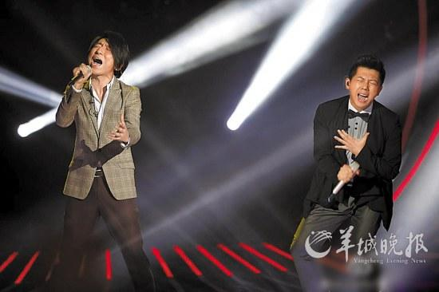

黄贯中将《吻别》改编成“摇滚版”

羽·泉一曲《烛光里的妈妈》让观众泪奔

在一众歌手和无数现场观众的“痛哭流涕”下，湖南卫视歌唱节目《我是歌手》第二期前晚落下了帷幕。最终，让现场观众哭得最惨的羽·泉以一曲《烛光里的妈妈》夺下本周周冠军；上周名列第六引起争议的黄绮珊绝地反击，靠一首同样让人潸然泪下的《离不开你》成功取得本周亚军的位置；上周垫底的陈明本周获第六名，上升一个名次；倒是上周获得第三名的黄贯中本周不幸垫底，并因综合票数最低而遗憾离场。对于黄贯中的离开，不少粉丝提出质疑，而更多人则表示，将《吻别》改成“黑色幽默”风格的黄贯中，赢了专业，但输了煽情。

## 精心改编成垫底 黄贯中遗憾出局

首期节目中，“小哥”齐秦以一首《夜夜夜夜》排名第一，而陈明则因身体不佳排名垫底。与上周不同，七位歌手本周不再演唱自己的作品，改为翻唱其他歌手的歌曲，包括羽·泉《烛光里的妈妈》、齐秦《用心良苦》、陈明《当我想你的时候》、黄贯中《吻别》、沙宝亮《秋意浓》、黄绮珊《离不开你》、尚雯婕《你怎么舍得我难过》。其中，黄贯中的《吻别》无疑是改编幅度最大的一首作品———张学友这首略带伤感的歌曲，在黄贯中口中被演绎成了“摇滚版”。这一改编，让无数业内人士叫好，休息区里的尚雯婕、黄绮珊、沙宝亮等都连连感叹“改得真好”！就连评委路遥也赞不绝口：“黄贯中的《吻别》被改出了一种黑色幽默，它需要慢慢品味，才能懂得它的宝贵。”但这种改编却并未受到普通听众的认可，因此在综合评分中，专业分最终不敌观众分，黄贯中出局。

对于黄贯中的离开，有许多网友表示遗憾与不满，更有人质疑节目的票数不够透明。网友“Beyond帝国”表示：“我们算算票数，上次第3这次第7，上次第7和这次第6，哪个多？”也有一些网友理性分析，黄贯中的落败是因为“选歌错误”，“而其他歌手太煽情，电视镜头里全是底下观众落泪的特写”。

## 哭得最惨分数高 羽·泉本周夺冠

和首期中歌手们纷纷选取豪放风格的歌曲不同，本期节目几乎所有歌手都不约而同地选择了煽情歌曲。尚雯婕在看到歌单的时候还开玩笑地说了句：“录像时得哭死。”

首位出场的黄绮珊选择了一首《离不开你》，一曲下来，台下不少观众跟着擦眼泪，黄绮珊回到休息室后也忍不住流下了热泪。就如主持人杜海涛所言，“我以前不知道听歌会哭的”。第三位出场的尚雯婕以一曲《你怎么舍得我难过》再次打动观众。而陈明深情演唱的《当我想你的时候》，不仅让观众为之动容，下台后她自己也坦言：“我好久没这样在台上流泪了，有十年了。”

说到本期的催泪弹，当属压轴出场最后夺冠的羽·泉。他们带来的《烛光里的妈妈》几乎唱哭了所有观众，电视镜头里给出了不下十个观众的“泪奔”大特写。不过，也有人认为，羽·泉的表演“情感因素”远远大于“唱功技巧”，而这种“情感主导”产生的最高分，并不理性。
