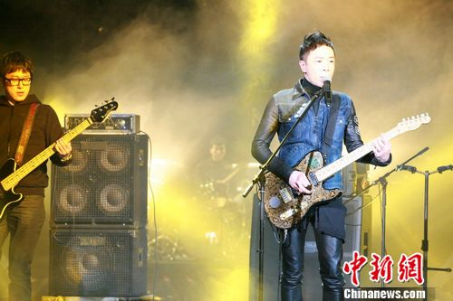

中新网1月29日电

1月26日晚《我是歌手》结束第一轮的残酷对决，黄贯中由于两轮票数累积最低而遭到淘汰，网友们对此结果感到遗憾，纷纷表示希望能够再给一次机会，让黄贯中留下。今日湖南卫视总编室表示，虽然黄贯中遗憾告别《我是歌手》的舞台，但已经邀请他参加湖南卫视小年夜春晚联欢。

相比于第一场《我是歌手》中《海阔天空》的经典再现，仿佛把大家再次拉回到令人怀念的Beyond时代，使得现场评委和观众们感动落泪，在26日当晚的比赛中，黄贯中一曲改编的摇滚版《吻别》似乎却并未赢得观众们的青睐，而他也因此最终遗憾告别这个舞台。对于当晚比赛的结果，不少网友们表示无法接受，表示希望导演组能够考虑观众们的意见，增设复活环节令其重返舞台，但目前节目组没有对是否能让黄贯中在《我是歌手》的舞台上“复活”予以回应。

尽管对于是否能复活表示未知，但是喜欢黄贯中和Beyond的观众们也不用太过失望，据记者从相关知情人处获悉，在第三场《我是歌手》节目中黄贯中将再次以返场嘉宾的身份，重回舞台继续为大家送上不死的摇滚，用他的真诚和率直，用他的柔情和不羁，继续诠释摇滚的灵魂；同时湖南卫视春晚导演组也正在积极和黄贯中沟通，希望用他的精彩演出在小年夜上再次征服大家。目前双方的沟通很顺利，“黄贯中最近的工作很多，只要档期能够协调好，他本人则表示不会让大家失望”，导演组一位知情人透露。

黄贯中刚“惜别”《我是歌手》的舞台，立即获得诚意邀请加盟助阵小年夜春晚，不难看出湖南卫视对黄贯中的热诚和青睐，而参加小年夜春晚是否会是《我是歌手》的复活演出做预热，湖南卫视并未给予回应。前不久摇滚教父崔健加盟湖南卫视春晚的消息刚得到证实，如果能够促成黄贯中和崔健两位摇滚界大咖的对话，相信一定会在小年夜当晚带给观众们最大的惊喜和感动。
