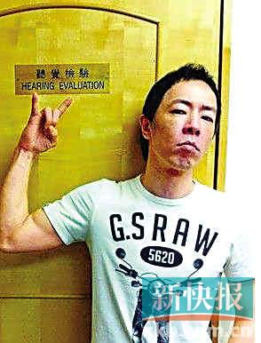
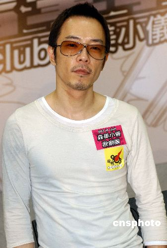

黄贯中

据香港媒体报道，早前荣升父亲的艺人黄贯中，涉于去年9月9日的立法会选举日，在投票站内拍照并将照片上载至微博，违反选举条例，警方经多个月调查后，前日在大埔区将黄拘捕带署后，准予保释候查，下月底返警署报到。

黄贯中当时晒出照片，大批粉丝还争相夸赞，但他自己在过夜后却把该照删除，黄贯中写道：“删除上一条微博，朋友告知原来这是犯法的，希望不会坐牢，唉！”

警方经调查后，前日将他拘捕，由大埔警区重案组第三队跟进。根据规定，最高可被判罚款5000元及监禁六个月。

黄贯中言行一向大胆麻辣，先前公开宣布基督徒女友朱茵未婚怀孕，并在微博中贴出两人的半裸黑白照片报喜，由于当时朱茵未婚，惹来网友批评黄贯中不顾禁忌。朱茵生下女儿后，黄贯中形容爱女为“好漂亮、新鲜出炉的‘叉烧包’”，之后又花了六位数为女儿庆祝百日宴，没想到才刚欢欢喜喜地庆祝，现在却被警察拘捕。

29日被拘捕后，他还轻松地说：“工作要紧，不方便受访，晚点再说，等我了解一下。”

黄贯中

黄贯中

黄贯中

黄贯中
