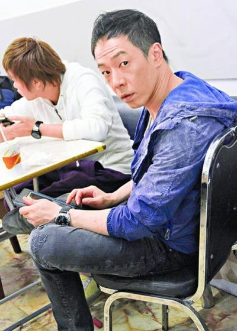

歌手黄贯中、谢安琪、刘浩龙等前天在香港清水湾拍摄电影《末日派对》。日前因违反选举法被捕获释的黄贯中，明显心情不怎么样，不愿受访，但走位时仍投入其中，十分专业。

黄贯中、谢安琪、刘浩龙前天与关楚耀、泰迪罗宾和马来西亚新人廖子妤，在清水湾影城为反映香港社会现况的电影《末日派对》，拍摄银行爆炸后的戏份，因此众人都披头散发、非常邋遢，他们都认为故事犹如香港的预言一样。

黄贯中去年在微博上载一张在立法会选举票站内拍摄的照片，因违反选举法在日前被捕，获准保释的他前天开工心情不怎么样，更拒绝接受访问，只坐在一边玩手机，很少与他人交流。但现场所见他依然投入拍摄，全然没有受官非而影响工作。 苗 菲
