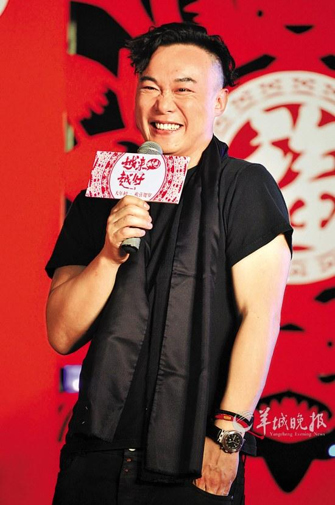
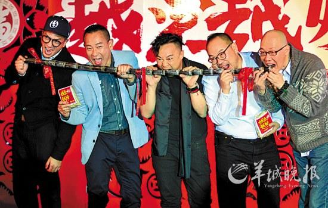
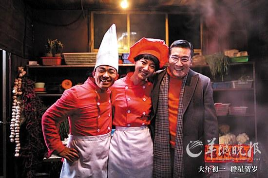

陈奕迅为影片演唱主题曲

发布会现场也充满欢乐

《越来越好之村晚》大牌明星云集

将于大年初一公映的群星贺岁片《越来越好之村晚》昨日来广州宣传，导演张一白和谢东燊带着主演黄觉、林保怡及主题曲演唱者陈奕迅亮相。昨日正好是北方的“小年”，剧组在广州举行了“祭灶”仪式，齐举赶着并大吃“灶王糖”。当天还有个额外惊喜：王菲和李亚鹏发来了祝福VCR。

## 现场直击 陈奕迅玩转冷笑话

### A，难得听到王菲说话

陈奕迅和王菲曾为《将爱》合作主题曲，这次陈奕迅为《村晚》演唱主题曲《稳稳的幸福》，王菲特意发视频来支持。陈奕迅谈感受：“好开心，很惊喜！因为很少能听到王菲开口说话！”一脸惊喜的表情让大家乐不可支。

### B，郭富城是压抑太久

张一白说，郭富城那场脱戏是他自己要求加的，“我本来没指望，没想到他竟然能放得那么开”。一旁的陈奕迅突然冷冷插嘴：“压抑太久！”他又补充：“不过如果我有这么好的身材，我肯定把裤子都脱了，只穿袜子！”

### C，我是世界文化圈的

有记者问他，能不能看懂片中的笑料？比如“元芳，你怎么看？”陈奕迅一脸纳闷：“元芳是谁？”记者笑说，他就是“粤语文化圈的人”。陈奕迅的表情更“惊讶”了：“原来我是这个圈的啊，我还一直以为我自己是世界文化圈的人！”

### D，《我是歌手》我怕怕

因为聊得很欢乐，有记者随口提到：“陈奕迅你怎么不去参加《我是歌手》？”在好不容易弄明白这是一档啥栏目之后，陈奕迅一脸惊吓的表情：“什么？每一集都要淘汰？我有点怕怕啊，你们刚刚说连黄贯中都被淘汰了，我不敢去！”

## 先睹为快

### “村晚”玩尽了，“春晚”还玩啥？

每年的央视“春晚”，都是过去一年民间热点的大汇集——去年的“春晚”便有不少网民打赌，看到底是哪个节目头一个说出“hold住”这个热词。今年，“春晚”的细节还没揭秘，“村晚”就捷足先登，在电影里把2012年的热点都狠狠盘点了一通。

### “舌尖”和“骑马舞”

王宝强在片中立志当大厨，但他却得不到真正的大厨梁家辉的认可。关于这两人的戏份基本上就是对去年的热门栏目《舌尖上的中国》的翻版——切菜、下锅、加料……装修工人郭富城也有绝技——他最后靠《江南Style》和骑马舞追回了前妻徐静蕾。

### “好声音”和“非诚”

张译和黄觉都是“混得好”的村民，两人都想在春节给乡亲们搞点乐子，“村晚版好声音”便是其中一大亮点。吴莫愁现身农民的大广场，亮起招牌式的“吴氏唱腔”，而周围的村民们则随着她的歌声又摇又摆——一洋一土之间，落差相当大。除了《中国好声音》，电影还山寨了一把《非诚勿扰》。

### “元芳”和“甄嬛”

“元芳，你怎么看？”“你幸福吗？”这两句去年的网络热门句式，也被搬到了电影里。吴君如扮演的“村花”本名就叫“元芳”，而她跟吴刚扮演的“黄昏恋情人”还模仿起了《甄嬛传》中的情节，深情念出“愿得一心人，白首不相离”的台词。

### “文学奖”和“石头心”

莫言得诺贝尔的事，在片中被恶搞到了佟大为身上——作为一个文学爱好者，他写了一部《钢的门》并被“提名”为某文学奖候选人，村里人因此激动地为他搞了座泥巴雕像。此外被“村晚”大玩一把的还有“到底是狼还是哈士奇”的段子，以及李晨的“石头心”——后者成了郭富城的定情信物，而且还是“加大版”。

## 终极彩蛋：章子怡

钟丽缇、伊能静、莫文蔚、林雪、林保仪、刘仪伟……除了主演，这片中一闪而过的“明星脸”还真不少。跟《泰囧》中的范冰冰一样，《村晚》也有一个“终极大彩蛋”——章子怡！而且，她演的就是她本人。

片中章子怡的出场相当令人意想不到——黄觉正在饭店跟刘仪伟吹牛，说自己跟章子怡很熟，刘仪伟便激他打电话给她，于是黄觉装模作样地拨电话：“子怡吗？我啊！”没想到，章子怡正坐在他的身后，黄觉一回头便看到她的盈盈笑脸，顿时结巴了，却也只能硬着头皮把话说完：“子怡啊，我说你别吃那么多大腰子，上火！”章子怡笑着回答：“我从来不吃大腰子，胆固醇太高。”第二次出场，黄觉在街上偶遇章子怡，勇敢地追上去，送了她一个写着自己电话号码的气球。第三次则是过年那晚，章子怡居然真的给黄觉打电话了，还笑着祝他春节快乐。
