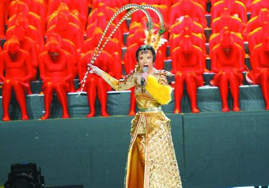

龚琳娜《金箍棒》变身孙悟空

龚琳娜一出，谁与争锋？前晚湖南卫视小年夜春晚上，龚琳娜的新神曲再度逆天。不仅如此，当曾轶可昨晚一开口，就算歌坛大姐大毛阿敏也“扶不住”了……这一夜，成了网友吐槽大会。

## 龚琳娜扮孙悟空来搅局

《金箍棒》一出，《法海你不懂爱》立马浮云。歌曲奇怪就暂且不论了，造型更诡异。不但老锣扮成唐僧来了一段《ONLY YOU》，演奏民乐的也都是些猪八戒、牛魔王，龚琳娜的造型就更“夸张了”：头发紧贴脑袋，金眉毛、红眼影，头顶紧箍咒、凤翅紫金冠……这哪是来唱歌的，分明是来搅局的孙悟空。

## 快男13强只来了10强

在之前的宣传中，2007年“快乐男声”13强重聚让不少人充满期待。不过等到前晚，观众才发现，原来这只是一场美好愿景，说好的13人，只来了10人。冠亚军陈楚生缺席，就连吉杰也没参加。而这三个人的身影，也仅仅是出现在谈到俞灏明烧伤和阿穆隆酒驾肇事时的VCR里。尽管这段节目成为小年夜里最强有力的“催泪弹”，可是3个人的缺席也成为了不少人的遗憾，有网友称“极不完整”。

## 曾轶可“带跑”毛阿敏

曾轶可究竟唱功有没有进步？大家各有各的看法。但绵羊音有多大威力，那就得问问毛阿敏了——跟曾轶可合唱，连毛阿敏都跑调！当毛阿敏抱着吉他唱起《狮子座》，可是明显看得出吉他属于现学，只能偶尔拨弄一下；但最让观众备受煎熬的，还是她俩合唱的那首《世界上最近的距离》，看得出毛阿敏很努力地在寻找曾轶可的音调，不过两人的声音始终都没和在一起。

## 崔健黄贯中抢一个话筒

一档《我是歌手》，把黄贯中拉到了观众面前，摇滚让观众泪流满面，因此湖南卫视小年夜的舞台上，崔健与黄贯中的合作更勾起了观众的情愫。无不过当两人合唱最后一首《从头再来》的时候，沸腾的感情也被“石化”了，不知出于什么原因，两人只能共用一个话筒，不少时候黄贯中都只能侧着头凑近话筒，有时候甚至还退到一旁，没话筒可用了。

## 采访 | 湖南卫视 | 这台晚会还算成功

记者昨日也采访了湖南卫视小年夜相关负责人员廖小姐，对网友们的质疑一一作出回应。她告诉记者：“龚琳娜老师的这次设计比较新颖出彩，融合了中国戏曲脸谱的东西，且融合了舞台剧的元素。快男虽然只来了10强，有各方面的因素，但是并不算遗憾，带给了大家许多回忆。”至于黄贯中和崔健共用一个话筒，她则表示导演组其实是有安排两个的。“可能观众每个人有自己的看法，但我们觉得还算成功。”
