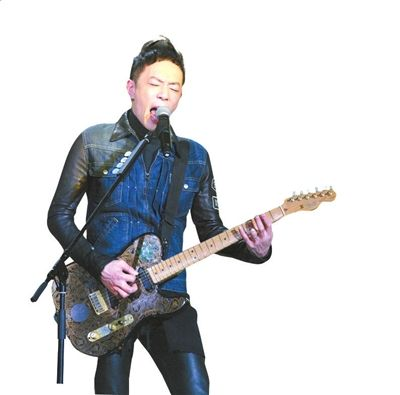

3月29日，《我是歌手》将迎来复活赛，黄贯中、沙宝亮、陈明、尚雯婕、杨宗纬将为一个复活名额而战。3月22日，在复活赛的录制中，背水一战的黄贯中并没有挑Beyond乐队的几首成名曲，而是选择了并不为观众熟悉的《我就是这样的》，他称希望让观众看到离开Beyond的黄贯中，一直在前行，虽未成功，但并未停止。

## 谈遗憾 | 上了两期节目即遭淘汰

作为《我是歌手》舞台上的摇滚乐代表，黄贯中只唱了两场，就被淘汰，他称非常遗憾。第一场，他唱的是Beyond成名作《海阔天空》，令全场沸腾，他也因此得了第三名。第二场，他唱的是改编过的张学友歌曲《吻别》，但并不尽如人意，排名第七。两场过后他得分排名垫底而率先出局，第三期节目中，他返场献歌，将一首《我终于失去了你》演唱得荡气回肠。结束时，黄贯中将吉他反放在话筒前，作为告别《我是歌手》舞台的仪式，悲情之举引得现场观众集体飙泪。

## 谈复活赛 | 唱自己的歌证明没歇着

在复活赛中，黄贯中没有演唱万众期待的《真的爱你》，而是选择了并不为观众熟悉的《我就是这样的》。黄贯中称，有很多人希望他唱Beyond的《真的爱你》，但他拒绝了，因为他要在这个舞台上唱自己的歌，“Beyond那是很多年前的事了，大家对我最近的十年在做什么，有点好奇，今天我豁出去了，完全不理这些，我要唱首自己的歌，而且这些歌词也代表我现在的心境。”黄贯中坦言，参加《我是歌手》之前，没有这么多人认识黄贯中，如果有，大家也只知道他唱过《大地》《海阔天空》《真的爱你》，“但那是很多年以前的事了，我想告诉大家，我没有懒惰过，一直在往前跑，虽然跑得不是那么好，不那么令人满意，但起码我没有歇着”。

黄贯中自称很享受复活赛，完全没有压力。他透露，如果能成功复活进入总决赛，一定把Beyond的黄家强和叶世荣两个兄弟叫来助阵，“我一个人赢没意思，我要摇滚赢。”黄贯中说他来参赛不是为个人，而是希望能推动摇滚乐的发展：“我觉得有责任来推动它。”

## 谈老婆 | 得到朱茵支持令他感动

去年十月，黄贯中升级当爹，在孩子不到半岁时跑出来参赛，黄贯中称得到了妻子朱茵的支持，“老婆对我比赛没有提什么意见，来之前，她只说了一句话，要我做自己。”黄贯中笑言，这句话朱茵说得一点也不温柔，但他很感动。
