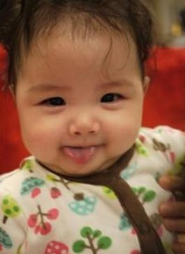

黄贯中晒女儿照片

今年是Beyond成立30周年，也是乐队灵魂人物黄家驹逝世20周年，但近日两位成员黄家强和黄贯中却在微博掀起骂战。黄家强在微博发文表示“遗憾没有把Beyond守护好”，而黄贯中继前日晒女儿照片、寄言“决不做寄生虫”后，又于昨天发言称“只望少个敌人”。

此次骂战导火线源于一名香港记者上传了和黄家强的一张合照，而黄贯中因和该记者有私人恩怨，不仅留言骂该记者为“毒人”，并称黄家强与该记者是一伙。黄家强留言表示，当兄弟就不应该这么说。随后黄贯中解释自己的矛头并不是指向黄家强。25日，黄家强在微博发表了一封致黄家驹的信，“对不起二哥，我无能，没有把Beyond守护好，自问我真的尽力了，我明白从你离开我们一刻开始Beyond已经伴你而去，一厢情愿只是我天真的想法，又何必强求呢！”

两人骂战一度引发粉丝激战，连黄贯中的女儿也被一些网友恶意攻击。前日，黄贯中在微博晒出女儿近照，并附言：“亲爱的，都是爸爸不好，未得你同意便把你带到这邪恶的世界，你还在妈妈肚子里时便要接受各种恶咒，有天你长大了，你会问：‘为何他们要我死？’爸爸会解释给你听，他们就是魔鬼，别听什么夭折，今天看着七月大的你，不是很好吗？我决心要把你养育成人，做一个快乐娃娃，全心贡献社会，决不做寄生虫。”昨日，他再发微博，言语间似指骂战有内幕：“算了吧，须知他们也只是一份工作罢了，各为其主无可厚非，只望少个敌人，不是更好吗？”
