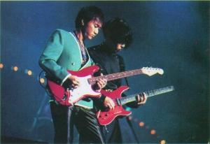
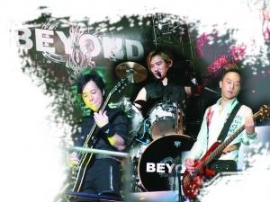

黄家驹过世，对Beyond打击很大。

Beyond三子中，黄贯中（左）与黄家强（右）已不是第一次吵架了。

今年是Beyond成军30周年，同时也是黄家驹逝世20周年，很多歌迷都在期待三子合体举办纪念音乐会，但没想到黄贯中和黄家强却再次在网上掀起骂战。黄贯中在微博爆料对方“在飞机不让座与（给）小女生，拳打助理”，以及直言“你再抹黑我，你的音乐也不会有进步的”。而前Beyond经纪人Leslie Chan也发表题为《Beyond30周年的意义》的长微博，直斥黄家强“别跟大家讲‘没有把Beyond守护好’，Beyond的解散、Beyond没有30周年演唱会，是谁的责任？歌迷不懂，但我懂。你的兄弟们对你一直非常地好，希望你会好好地反思，不要再跟歌迷说你很善良，我看了也想吐”。

## 黄家强遭遇兄弟“围剿”

因为即将在香港举行个人演唱会，黄家强除写了新歌《好好》送给哥哥外，更发起“今天我好好”纪念活动，日前更在香港媒体发布公开信，声称“对不起二哥，没有把Beyond守护好”。他在信中称自黄家驹离去，Beyond乐队也已经伴随离去，只是自己一厢情愿Beyond能够继续，不必再强求。这番言论却引来Beyond前经纪人Leslie Chan的不满，他连续发布题为《Beyond30周年的意义》的长微博，指黄家强拿着黄家驹来宣传：“在Beyond里你有付出，你旁边的两位兄弟也同样有付出，家驹成立Beyond，并不代表后来的Beyond是属于你的，在家里你是家驹的弟弟，在Beyond里你是黄家强，跟黄贯中、叶世荣一样，只是Beyond其中的一位成员，别跟大家讲‘没有把Beyond守护好’，Beyond的解散、Beyond没有30周年演唱会，是谁的责任？歌迷不懂，但我懂。你的兄弟们对你一直非常地好，希望你会好好地反思，不要再跟歌迷说你很善良，我看了也想吐。”

而黄贯中也转发这条微博，并称Leslie Chan太清楚黄家强了，“我真心送家驹一首《故事》也被他骂得狗血淋头，明眼人都记得五年前那‘个唱’，我和世荣在后台只获派唱两首，多心痛，我和世荣怒了，那不是纪念家驹吗？其实只要你换少三四套华衣，我们就可多唱几首”。

而因为一些外人难知的恩怨，以及粉丝之间的骂战，黄贯中还质问“家强，我有什么得罪你”，并称两人之前有过面对面，但对方对演出和照片（指黄家强这次发起的纪念黄家驹的活动）的事情只字不提，现在还用“水军”攻击自己，辱骂自己刚出生的女儿。黄贯中还称再这样抹黑自己，黄家强的音乐也不会有进步，而最需要的是对自己和叶世荣的信任。

## 黄贯中称兄弟伙同“毒人”

据报道，本次骂战起源于一名香港记者日前上传了和黄家强的一张合照，黄家强也有转发这条微博，而由于黄贯中和该记者有私怨，不仅留言称该记者是“毒人”，并说黄家强和该记者是一伙。黄家强则留言说，当兄弟就不应该这么说，说什么和“毒人”一伙，让人听着真伤心，两人的“交锋”引起网友关注。于是有黄家强的粉丝斥责黄贯中没有参与对方发起的怀念黄家驹的“今天我好好”拍照活动，更有水军翻起旧账，指黄贯中没有前往黄家驹的陵墓拜祭，甚至直接爆出粗口。虽然黄家强和黄贯中等人多次强调双方私下无不和，而早前黄家强确定开个人演唱会时也在微博有@黄贯中和叶世荣，三子也都有互动，没成想还是引起骂战。

而黄贯中和香港记者的私人恩怨，事缘刚早前完成红馆演唱会时不满被香港报纸指首场入座率只有七成爆发是非，认为被抹黑，于是连续多天在微博向该家报纸以及记者开火。黄贯中粉丝支持偶像，该记者也在Facebook留言还击，令事件一发不可收拾。而黄家强和该记者交情匪浅，在微博留言劝架，并称希望大家谨记黄家驹所创造的Beyond是宣扬和平与爱，希望大家冷静处事，不要令Beyond蒙上污点，也劝黄贯中“少些戾气”。而黄贯中则转头反击黄家强，但仍称黄家强是“好朋友”。

此次黄家强和另一位香港记者合影，黄贯中在下面留言称该记者和自己之前开火的记者“是一伙”，黄家强误会说自己“和毒人一伙”，并称“他没有说清楚，也不告诉我，就这样公开骂骂骂骂，之后更多人帮骂我……他永远是对的，我不申冤，我死不瞑目。”于是便引发更多口水战。

## 恩怨情仇20年 | 解散

1999年三人宣布推出《Goodtime》以及暂别演唱会，乐队暂时解散，三子各自发展。有称是黄贯中率先主动要求解散乐队作个人发展。

## 朱茵

据香港媒体爆料，黄家强与黄贯中失和的导火线全因朱茵而起。2003年朱茵和黄贯中去泰国苏梅岛度假，不料却不慎走漏风声，照片曝光后，朱茵放言斥责身边人爆料，矛头直指黄家强。

## 开骂

2005年举行完《Beyond the Story Live》巡回演唱会后正式解散。其后黄贯中与黄家强不时隔空骂战，最后一场马来西亚巡回个唱，更因二人不和而取消。

## 缺席

2006年黄家强娶日籍妻子Makiko，黄贯中以在北京工作为由，缺席黄家强婚宴，此外黄贯中还缺席对方儿子百日宴。而2011年叶世荣在北京结婚，黄家强和黄贯中都未有到场。

## 打架

2009年叶世荣往内地发展，以Beyond名义开唱，据传此举令黄家强及黄贯中不满。同年7月，黄贯中和黄家强合体举行三场演出，叶世荣则未有获邀。而此间还传出为一首歌意见分歧，在酒吧大打出手。

## Beyond30周年成一地鸡毛 | 分裂

根据前Beyond经纪人Leslie Chan的长微博，“Beyond30周年演唱会”其实有过酝酿，但因为成员间的矛盾无法做成，现在只能是黄家强做自己的个人演唱会，以及稍后叶世荣也会有自己的个人演唱会，但各方都不介意成员以Beyond的名义搞纪念活动。

## 照片

为了有所纪念之前叶世荣有写歌《薪火相传》，黄家强也写了《好好》，并发起“今天我好好”纪念活动，其中叶世荣有参与拍照，而黄贯中也称自己早已经上传了照片，但和黄家强见面时对方没有主动提及。

## 合体

还有一个粉丝关注的焦点是黄家强的个人演唱会，有没有邀请黄贯中到场担任嘉宾，对此黄贯中方面是指做好准备，但没有收到邀请。

## 噱头

Leslie Chan就不满黄家强为个唱博版面每次都拿黄家驹做文章，“有点过了”，而“开演唱会是家驹所讲”以及“没有把Beyond守护好”这样的语句也让他不爽，因为他认为“把歌唱好，拿出真意来就足够了，其他都是多余的”。

## 拜祭

Leslie Chan承认Beyond三子关系不太好，但也没有大事情，歌迷们希望Beyond可以继续在一起，但三子有了各自的事业和生活，“Beyond只是他们人生的一个段落”。而关于之前有报道黄贯中没有前往黄家驹墓地拜祭，Leslie Chan也代澄清他只是晚上去，没有通知媒体。丁慧峰
