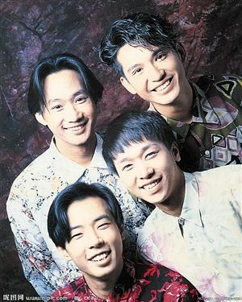

Beyond早年合影。

今年6月30日是香港殿堂级摇滚乐队Beyond的主唱兼节奏吉他手——黄家驹逝世20周年忌日，却没想到乐队成员黄贯中和黄家强却在微博掀起骂战。5月27日，前Beyond经纪人通过微博发表题为《Beyond30周年的意义》的长微博，共五篇，文中主要是以劝和为主题，力挺黄贯中。随后，黄贯中转发此微博称：“家强，我有什么得罪你”更直指其借今年黄家驹之际博版面，故意抹黑自己，骂战再次升级。

## 前经纪人力挺黄贯中

前Beyond经纪人于5月27日先后更新五次微博，发表题为《Beyond30周年的意义》的长篇微博，力挺黄贯中，暗指黄家强拿着黄家驹的名字来宣传，文中说：“把歌唱好，拿出真意来就足够了，其他的都是多余”，并直言道：“在Beyond里你有付出，你旁边的两位兄弟也同样有付出，家驹成立Beyond，并不代表后来的Beyond是属于你的，在家里你是家驹的弟弟，在Beyond里你是黄家强，跟黄贯中、叶世荣一样，只是Beyond其中的一位成员，别跟大家讲‘没有把Beyond守护好’，Beyond的解散、Beyond没有30周年演唱会，是谁的责任？歌迷不懂，但我懂。你的兄弟们对你一直非常的好，希望你会好好地反思，不要再跟歌迷说你很善良，我看了也想吐。”

## 积怨已久突然爆发

随后，黄贯中于同一天转发此微博，并几次更新，称：“家强，我有什么得罪你，男人老狗，那天和你面对面，你居然对演出及照片只字不提，现在还用五毛去攻击我，对你的‘个唱’真的有帮助？抚心自问，你再抹黑我，你的音乐也不会进步的。”

据报道，事情起源于一名记者上传了和黄家强的一张合照，而由于黄贯中和该记者有私怨，不仅留言骂该名记者是“毒人”，并说黄家强和该记者是一伙。黄家强则留言说，当兄弟就不应该这么说，说什么和“毒人”一伙，让人听着真伤心。两人的骂战马上引起网友关注。

## 网友：别让在天之灵伤心

黄贯中黄家强的骂战也引起粉丝的广泛关注，但粉丝大都理性对待。在网络调查“你怎么看Beyond前成员黄贯中斥黄家强抹黑？”这一项，49%的人选择“各有各的理，Beyond解散始终是个谜。”对于“黄贯中和黄家强骂战上，你站在哪一边？”近一半网友表示，“我都不支持，私人恩怨致Beyond名誉受损 。”有网友留言，“这么多年恩恩怨怨的，歌迷早就不做复合梦了。只希望你们三人好好的，别让家驹被消费还得在天上伤心。退一步海阔天空。”
