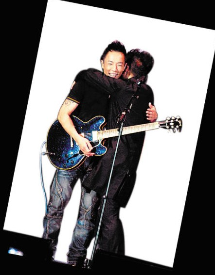
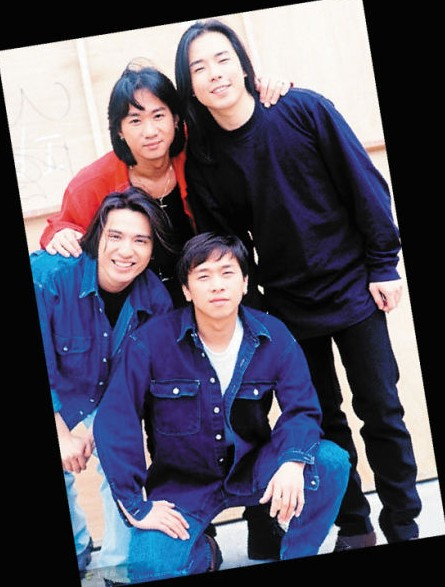

两人曾在舞台上拥抱和解

昔日的Beyond四子

香港殿堂级摇滚乐队Beyond成员黄贯中和黄家强近日在微博掀起骂战（见本报昨日B1版），而前Beyond经纪人也加入了战团，在微博发表题为《Beyond30周年的意义》长微博，力挺黄贯中。黄贯中也转发该微博，并称黄家强为宣传演唱会博取版面而故意抹黑自己，令骂战再度升级！

## 昔日 | 恩怨 | 音乐理念不同散伙

1993年，Beyond“灵魂”黄家驹意外去世后，乐队于1999年宣布暂时解散。在2003年Beyond成立20周年之际，黄贯中、黄家强和叶世荣曾一度以乐队形式复出举行演唱会。但2005年乐队再度宣布解散。当时，黄家强和黄贯中便传出不和，据悉两人因演唱曲目而发生争执，致使原定的马来西亚演唱会被迫取消。

## 朱茵导致关系决裂

2003年，黄贯中和朱茵去泰国度假，不料走漏风声，媒体拍到朱茵未化妆及身穿三点式泳衣的照片。照片曝光后，朱茵放言斥责身边人爆料，矛头直指黄家强，令黄贯中与之反目成仇。

两人内讧后，乐坛前辈谭咏麟、单立文等曾“劝架”。乐队另一成员叶世荣曾提出给双方摆和解酒，却遭黄贯中一口拒绝。

## 曾经短暂牵手言和

2008年，黄贯中和黄家强一度握手言和，两人还在台上一抱泯恩仇。不过好景不长，因叶世荣经常以Beyond的名义在内地开唱，惹来黄家强和黄贯中的不满，而后两人一起举办了一系列“乐与怒”演唱会，但没有邀请叶世荣。不料，两人在合作出唱片时，因为一首歌出现意见分歧，在酒吧里大打出手，再次翻脸。

## 成立30年各自纪念

在Beyond成立30周年之际，乐队重组无望，但三人都将以各自的方式怀念Beyond、纪念黄家驹。黄家强将于6月在香港举行“It’s Alright”演唱会。叶世荣也推出了纪念黄家驹的新歌《薪火相传》，并将在7月举行个人演唱会。

而黄贯中表示自己不会举行什么纪念活动，因为怀念家驹不是通过某一天的活动，把歌唱好、把摇滚玩好，就是对家驹最好的纪念。

## 骂战 | 升级 | 前经纪人指黄家强博宣传

27日，Beyond前经纪人Leslie chan在微博上发表了题为《Beyond30周年的意义》长微博，文中暗指黄家强以黄家驹的名字做宣传，“你是家驹的胞弟，你是Beyond的早期成员，今天你只要站出来说：我写了《好好》作为我个人对家驹的致敬，我也准备开个人演唱会，这便足够了，大家都会支持你。需要每天拿着家驹的名字来搞那些无谓的宣传吗？把歌唱好、拿出真意来就足够了，其他的都是多余的。”

“家驹成立Beyond，并不代表后来的Beyond是属于你的，你跟黄贯中、叶世荣一样，只是Beyond的一位成员，（没有资格）跟大家讲‘没有把Beyond守护好’。Beyond没有30周年演唱会，是谁的责任？歌迷不懂，但我懂、你更懂。兄弟们对你一直非常好，希望你好好反思，不要再跟歌迷说你很善良，我看了也想吐。”

他又在微博上力挺黄贯中， “阿Paul（黄贯中）每次去拜家驹都是在深夜，没有人知道，家强去拜家驹就会有记者在场拍照见报，有好几年都是这样，我觉得非常奇怪，为什么那么巧？”

## 黄贯中斥黄家强抹黑自己

而黄贯中也转发该长微博，并多次更新留言回应，不但翻出旧日恩怨，更指黄家强为了宣传个唱而刻意攻击自己，“Leslie chan太清楚家强了，每次他都说：家驹要他这样，家驹报梦这样，我真心送家驹一首歌也被他骂得狗血淋头，明眼人都记得五年前那‘个唱’，我和世荣在后台只获派唱两首，我们怒了，其实只要你换少三四套华衣，我们就可多唱几首……”

“家强，我有什么得罪你，男人老狗，那天和你面对面，你居然对演出及照片只字不提，现在还攻击我，对你的个唱真的有帮助？扪心自问，你再抹黑我，你的音乐也不会进步的！”

## 网友 | 热议

小熊小罗一家亲：靠别人的名字壮大自己的名声确实欠妥，特别是已经逝世的人。本是同根生，相煎何太急，歌迷都希望你们好好的！

biang-样吧：我不知道谁对谁错，也不需要知道！只想说你们都脑残，白喜欢你们这么多年了，就不说能不能对得起家驹了，你们对得起这么多歌迷？

远处花儿开：海阔天空，但愿Beyond的形象不要因此毁于一旦，乐队给予我们的一直是积极向上的人生态度，催人奋进的呐喊，有什么私下解决，为了Beyond，为黄家驹！请克制！
