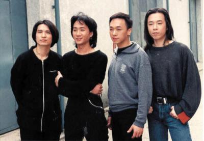
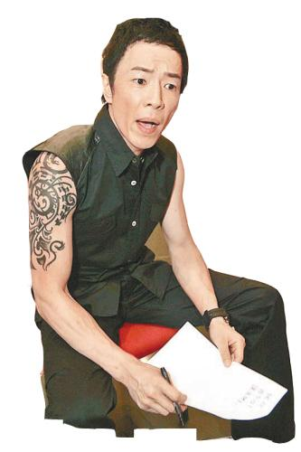

Beyond乐队。

黄贯中 资料图

黄家强 资料图

朱茵 资料图

据香港媒体报道，今年6月30日是香港殿堂级摇滚乐队Beyond的主唱兼节奏吉他手黄家驹逝世20周年忌日，却没想到乐队成员黄贯中和黄家强在微博掀起骂战。据香港媒体表示，黄家强同黄贯中不和的新闻已经传了好几年，其实最开始二人的交恶原因是因为朱茵。

据港媒表示，黄家强同黄贯中交恶一开始的导火线是女人——朱茵。黄贯中同朱茵的情缘由1998年开始，2003年两人到泰国苏梅岛度假行踪外泄，朱茵不止被照到三点式泳装，报道还说她身材走样，有指朱茵非常生气，斥男友身边人放料，矛头直指家强，自此家强同黄贯中反目，事后家强否认指控。

此外，朱茵当年讲及“婚前性行为”论，黄家强讲笑说黄贯中还是处男，有指引起朱茵不满，事后黄家强没想到说个笑话就令她有那么大反应。加上被偷拍事件，2003年朱茵更直言：“真是替Paul不值，我知道这行是互惠互利、互相宣传，但paul身边人不断拿他做宣传、又玩爆料，简直是出卖友情！”

2005年，他们最后一次以Beyond名义开个唱，黄贯中同黄家强闹意见，自此3年完全没有联络，Beyond亦正式解散。

2008年，黄家强举行《别了家驹15载海阔天空音乐会》，黄贯中同叶世荣最后都有上台，当时气氛还ok，不过想不到今日黄贯中又旧事重提：“明眼人都记得五年前那个唱，我和世荣在后台只获派唱两首，多心痛，我和世荣怒了，那不是纪念家驹吗？其实只要你换少三四套华衣，我们就可以多唱几首。”这个“你”，矛头直指黄家强。文、图据搜狐

## Beyond乐队翻脸内情 | 黄家强黄贯中曾在酒吧大打出手

48岁的叶世荣，去年12月27日再婚，迎娶比自己年轻22岁的北京嫩模张伟铃。鼓手大婚，Beyond另外两位成员家强和黄贯中却未获通知。其实Beyond三人心病，早在三年前种下，当时叶世荣到内地发展，经常以Beyond名义在内地开唱，黄家强直指对方借Beyond发财，两人从此无联系；至于黄家强和黄贯中，2009年抛弃叶世荣在香港开唱后，竟为一首歌意见有分歧，在酒吧大打出手，俨如《天与地》真实版。一起唱歌很有默契，却没办法好好相处，昔日肝胆相照的好兄弟，今日各走各路。

有指对叶世荣最不满的黄家强，去年两人不约而同在黄家驹生忌(6月19日)前往拜祭，却刚好撞见，两个互当透明未有交谈。“那时候他们骂世荣的话真的好难听，但其实黄贯中、黄家强现在都有用Beyond的名义去内地演出，也一样有唱Beyond的歌！其实大家各做各的，应该互相体谅。”叶世荣身边好友说。事实上，近年工作量没多少的黄家强，因为身家丰厚，根本没经济压力。

2009年7月，黄家强决定和阿Paul “复合”开唱，抛弃叶世荣。“他们两个搞双星Rock n Roll Live，也一样唱Beyond的歌，他们以为可以安然无恙，谁知道开完Rock n Roll Live，二人竟因为合作出唱片问题，为一首歌出现意见分歧，在尖沙咀一间酒吧大打出手。“家强还气到拿起椅子扔到黄贯中那，推推撞撞打烂了很多东西，黄贯中又学过泰拳，还好有朋友拉开大家才没受伤，不过两人却翻脸了！”知情者说。

Beyond由地下穷乐队，到现在成为乐队界一哥，多年友情全靠黄家驹维系，但自从失去灵魂人物，黄家强黄贯中经常因音乐路向各异而吵架，昔日好兄弟情已不再，歌迷想Beyond为三十周年开唱，难！

1983年黄家驹、叶世荣与其他成员组成Beyond，参加吉他比赛得冠军，以玩票性质组成乐队，直至1983年黄家强加入，Beyond正式成型，亦在1985年自资搞“永远等待演唱会”及出唱片，同年阿Paul(黄贯中)才加入。

1987年当时Beyond有五位成员，除黄家驹、黄家强、黄贯中、叶世荣，还有刘志远， 1987年推出首张EP《永远等待》，正式踏入主流乐坛。1988年刘志远退出，四人Beyond签约新艺宝，作品《喜欢你》、《大地》大受欢迎。

1989年推出大碟《真的爱你》及《Beyond IV》，以及1990年专辑《命运派对》，共获五白金销量(25万张)，先后在新伊馆及红馆举行十多场演唱会，其后更到台湾以及马来西亚等地发展，是Beyond的光辉时期。

1993年Beyond推出在日本制作的新碟《乐与怒》，同年6月，于日本东京富士电视台录像游戏节目时，主音黄家驹从高台坠下，数天后逝世，终年31岁，Beyond三人受到重大打击。

1999年三人宣布推出《Goodtime》以及暂别演唱会，乐队暂时解散。据知是阿Paul主动要求解散乐队作个人发展。

2008年为赚钱“复合”举行Beyond成立廿五周年演唱会，有指世荣一直是唱双簧的和事老。

2009年叶世荣前往内地发展，以Beyond名义开唱，令家强及阿Paul不满。同年7月，阿Paul家强举行三场“Rock n Roll Live”，叶世荣没份。
