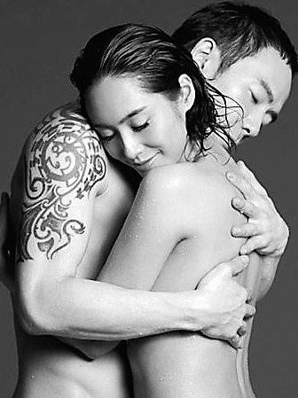

朱茵与黄贯中朱茵与黄贯中朱茵与黄贯中 资料图

昨日，本报报道了在Beyond主唱兼节奏吉他手黄家驹逝世20周年忌日前，乐队成员黄贯中和黄家强在微博上掀骂战的新闻，据香港媒体报道，黄家强与黄贯中交恶原因是因为朱茵。

据港媒表示，黄贯中同朱茵的情缘由1998年开始，2003年两人到泰国苏梅岛度假行踪外泄，朱茵不只被照到三点式泳装，报道还说她身材走样，有指朱茵非常生气，斥男友身边人放料，矛头直指家强，自此家强同黄贯中反目，事后家强否认指控。

此外，朱茵当年讲及“婚前性行为”论，家强当年讲笑说黄贯中还是处男，有指引起朱茵不满，事后家强没想到说个笑话令她有那么大反应。加上被偷拍事件，2003年朱茵更直言：“真是替Paul不值，我知道这行是互惠互利、互相宣传，但paul身边人不断拿他做宣传、又玩爆料，简直是出卖友情！”
