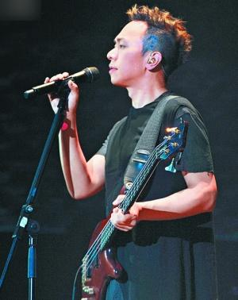
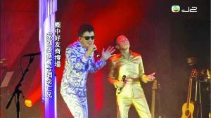
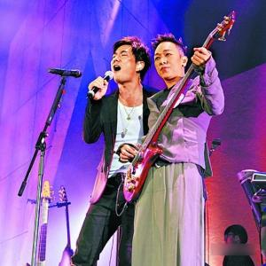
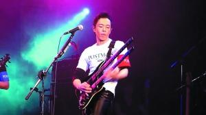
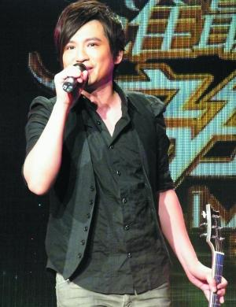

黄家强前晚开演唱会悼念哥哥黄家驹。

黄耀明前晚和黄家强合唱。

任贤齐支持黄家强。

黄贯中

叶世荣

黄家强和黄贯中非但没有重组Beyond，为黄家驹办纪念音乐会，近日还爆发连环骂战。之前黄贯中还在微博说黄家强“买名表”、“买豪宅”，更有粉丝指责家强未有兑现20年前用黄家驹过世后所获得的赔偿金开办音乐学校的承诺，私吞接近一亿港元。

黄贯中近日接受香港周刊采访首度表态，称自己一分钱都没拿。而黄家强前晚在举行完个唱之后也回应说自己没私吞，都是靠努力工作赚钱。

## 黄贯中暗示赔偿金被挥霍

早前香港媒体称当年黄家驹在参加日本富士电视台游戏节目时不幸离世，对方曾支付接近一亿港元的赔偿金，黄贯中和叶世荣也有获得赔偿，但一干人签下保密协议，不能向外公布有关金额内容。而日前黄贯中接受香港周刊访问时，就称自己一分一毫都没有拿过，“钱买不到我，我有手有脚可以赚钱，用音乐告诉家驹我很好，但其实我想说，我不好，我熬得很辛苦。”

而对于粉丝指控家强未兑现承诺开音乐学校，黄贯中就说：“他损失了哥哥，一家人都很大损失，那些钱怎么用是他自己的选择。”

有粉丝在微博控诉黄家强，如果真的怀念哥哥就兑现承诺，用他牺牲换来的赔偿金成立以黄家驹名字命名的音乐学校，而黄贯中就转发这条微博称黄家强“买名车名表名楼好D，学校，哎……”

## 黄家强称没住豪宅

对此，黄家强前晚接受访问时，也指当年有保密协议不能公布金额，但知道具体金额不会有很多，仅够父母养老。黄贯中说自己没有拿一分钱，黄家强也说自己没有拿，大家都努力工作，但自己没有“熬”，靠努力去赚钱不觉得辛苦。他还否认住“山顶豪宅”和“独立大屋”，只是住普通单位。

## 黄家强开唱悼亡兄 | 队友没到 黄耀明任贤齐力撑

黄家强前晚在香港举行《It's Alright演唱会》，悼念亡兄黄家驹逝世20周年。

队友黄贯中和叶世荣都没有到场，但叶世荣有送花牌到场送祝福，足见他与黄家强没有闹翻。而黄耀明任贤齐等歌手以嘉宾身份登台献唱，力撑黄家强。

台下，黄家强的父母、姐姐以及老婆孩子也齐心打气。而粉丝们更是在台下大喊：“不要理他（指黄贯中）！明白，撑你！”这一场面也让近日饱受黄贯中非议的黄家强大为感动。

今年是黄家驹逝世20周年，作为亲弟弟的黄家强前晚也在个唱上向黄家驹致敬。

黄家强坦言哥哥一直是他的音乐启蒙老师，他当晚选唱了《谁伴我闯荡》与黄家驹在荧屏上对唱。现场有歌迷自发带来白蜡烛，他们更派给黄家强的父母及亲朋好友，众人点起烛光一同悼念黄家驹，场面感人。

黄家强以黄家驹教他弹吉他的第一首歌《Love will tears us apart》作为纪念环节的开始，其间播出家驹的片段，当中他说：“大家是不是觉得黄家强很少讲话呢？这个就是我的弟弟，家强！”随后黄家强再唱出《海阔天空》、《祝你愉快》及《好好》送给黄家驹。

家强有感而发地说：“和我一起成长的哥哥教了我好多东西，但他只教了我一半，以后的路要自己去走。他今日来陪我一起唱，我好需要他。我只想在自己演唱会上开开心心，和你们一起纪念他，我觉得为什么纪念人……”台下歌迷闻言即大叫：“不要理他！明白，撑你！你最高贵，他（指黄贯中）讲的都是废话！”黄家强微笑以示感谢。

黄家强物业

西洋菜街巨成大厦，1992年165万购入，现市值302万

窝打老道美佳大厦，1995年530万购入，2008年卖出，赚230万

广播道嘉翠园，1992年220万购入，1996年卖出，赚48万

大埔康乐园，1998年731万购入，2006年卖出，赚369万

七宝街志发工业大厦，2009年178万购入，现市值208万

何文田常乐园，2006年1165万购入，现市值1600万

Beyond三子 家强物业最多

Beyond各散东西后，三子大多时候各自为战，事业一直未有再创辉煌，黄贯中更说自己“熬得很辛苦”。根据香港周刊的统计，黄家强相对生活富足，不断买店铺保值。

黄贯中物业

大埔林村村屋连丁地，1998年430万（港元，下同）购入，现市值600万

叶世荣物业

筲箕湾广场，1996年273万购入，2006年卖出，亏113万

太古城海景花园，2004年730万购入，现市值920万
