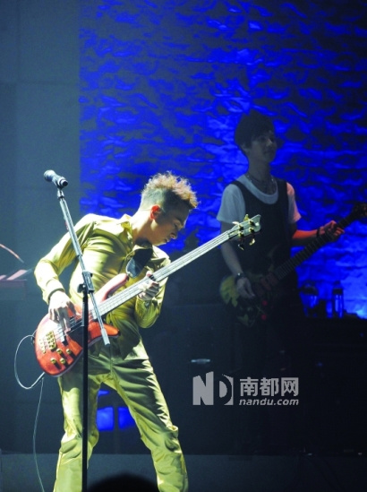

昨晚，黄家强在香港九展Starhall举行“It’s A lright”演唱会尾场，以此纪念家驹逝世20周年，黄耀明、任贤齐、卢凯彤等嘉宾亦亮相支持家强。一直没对Beyond骂战事件作出公开回应的家强，终于在台上打破沉默，说到动情处更是语带哽咽：“我要重申，这个是我黄家强的个人演唱会，大家不要误会。身为家驹的弟弟，难道我连跟哥哥说一句‘很想念你’都不行？是不是当弟弟的，什么也不能做呢？我不管别人怎么说，我就是要怀念我哥哥。你们做(纪念活动)也好，不做也好，我不管，但你们不能阻止我这样做！”

在演唱会中，家强跟乐迷分享“夹Band”过程中遇到的苦与乐，有观众大喊“找其他两位兄弟(黄贯中、叶世荣)一起开Show”，家强笑道：“我现在也有一群兄弟跟我在一起(蔡德才等六位乐队成员)，少了两个，多了六个！不过还是不要乱说，世事永远没有绝对。”虽然叶世荣没有出席当晚的演出，但在家强演唱为家驹而写的新歌《好好》时，大屏幕第一张弹出来的就是叶世荣向家驹致意的照片。除了世荣，周润发、杨千女华、刘德华、郑秀文、王菲等歌手亦响应家强的号召，拍照告诉家驹“今天我好好”。演唱会尾声时，家强更献唱他在Beyond年代的成名作《冷雨夜》：“感谢家驹送这首歌给我！”
