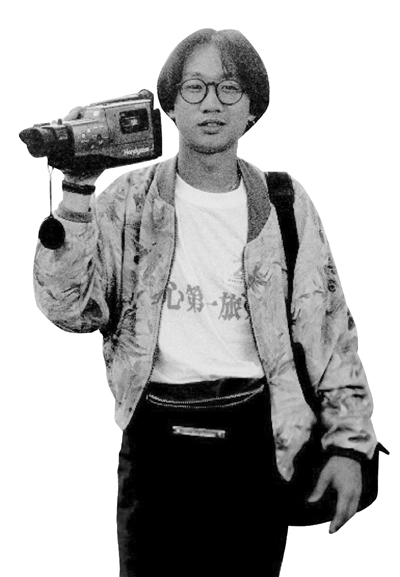
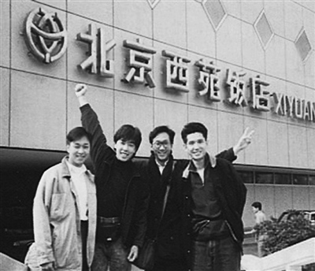
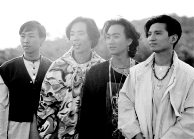

黄家驹在肯尼亚期间。非洲的探访经历，也成为他后来歌曲创作的灵感

《海阔天空》这首歌出自于Beyond 1993年发行的粤语专辑《乐与怒》，黄家驹词曲。歌词承载了黄家驹与乐队赴日本发展的艰辛与对理想的坚持。同年6月30日，黄家驹在日本辞世，《海阔天空》成为绝唱。在1993年的叱咤乐坛流行榜颁奖典礼上，这首歌获“我最喜爱的本地创作歌曲大奖”，黄家强、黄贯中、叶世荣登台演唱时几度哽咽，该曲也引发了包括四大天王、王菲等巨星在内的全场合唱，成为香港乐坛最动人的瞬间之一。《海阔天空》是黄家驹热血、执著个性与惊鸿一瞥人生的写照，它是Beyond最脍炙人口的作品，多年来被广为传唱。

原谅我这一生不羁放纵爱自由

也会怕有一天会跌倒

背弃了理想 谁人都可以

哪会怕有一天只你共我

——节选自《海阔天空》歌词

## 家驹前史 茶花楼里，一把弃琴与一个传奇的诞生

1962年6月10日，黄家驹出生于一个平凡的劳工家庭。排行第四的家驹有一个哥哥和两个姐姐，当家驹还未到两岁的时候，家里增添了最后一个成员黄家强，他们一家七口住在九龙深水埗苏屋邨徙置区内茶花楼一个不到三十平方米的小单位。说来真是有点神奇，苏屋邨一直以来都出产过不少演艺界的人材，同期除了家驹、家强，还有多才多艺的音乐人周启生和有“白马王子”外号的香港电台DJ歌手蔡枫华，知名度很高的要算是许氏兄弟许冠文、许冠杰和许冠英，而伍卫国、谢天华、林嘉华等人都是具有名气的演员。

背山望海的苏屋邨在风水学来说确是一个好地方，1955年政府兴建苏屋邨徙置当地的木屋区居民，在夷平附近李郑屋村山坡时发现一个属于东汉时期的华南贵族古墓，这样的发现在香港历史上非常罕有。家驹的父母是属于第一批于1960年开始入住苏屋邨的居民，可惜至今日差不多已经有五十年历史的苏屋邨已于2008年开始逐步清拆。

家驹——寓意是家里的一匹马，虽然家驹的生肖是属虎，但他也有像马一般的个性，茶花楼的细小居住空间完全不能满足家驹那份天赋活跃又喜欢面对挑战的个性。小时候的家驹大部分时间都在户外活动，只是偶然从大姐的一些party中接触到一些七十年代的摇滚音乐，但是对他(来说)比较有印象的只有Deep Purple及Led Zeppelin等比较heavy(重型)的摇滚乐队。直至一天，闲在家里的家驹在电视中看到一位前卫英国歌手的音乐影带，它开始改变家驹的命运，这位就是著名的英国Glam Rock代表人物David Bowie。

之后家驹开始寻找一切有关Bowie的音乐和资料，为了表现自己是Bowie的忠实追随者，家驹更跑去经营批发布料的南昌街、大南街挑选布料，然后再拿去观奇洋服要求裁缝做一些奇异的西裤或衬衫。虽然Bowie的音乐对家驹有很强烈的影响，但当时的家驹尚未开发自己的音乐空间，都只是局限为一个单纯的“狂热Bowie追随者”。

有一天，如常放学回家的家驹在踏上茶花楼的梯间时，发现一把被人弃置的旧木吉他，在好奇的驱使下，他把吉他拿起来看了又看，觉得吉他虽然比较陈旧，但看起来还是可以演奏的，于是把木吉他拿回家。家驹把吉他放在自己的床上，呆了半天后再把吉他拿起来，看了一眼便决定，把它留下来……

成绩一向都不好的家驹，对学术完全缺乏自信，而家里有限的条件和空间，除了全都要与兄姐及弟弟分享外，他更是找不出有什么原因需要固定在家里做一些老老实实的事情，现在，这一把被丢弃的吉他，却让他突然找到一点属于自己的小空间。

接下来，茶花楼不再是唯一能听到家驹弹吉他的地方。家驹开始与同学上band房夹歌(去排练房排练)，开始在小型的派对等演出，不知不觉地开始了他生命中最重要的旅程。愈来愈多的机会接触到摇滚音乐，令家驹产生一种愈来愈强烈的欲望，那就是：要成为一位出色的摇滚吉他手。

摘自Beyond 30周年纪念系列《真的Beyond历史》中《没有家驹就没有Beyond》章节，有删减。

## 香港 首场演唱会

时间：1985年7月20日

地点：香港坚道明爱中心

尚为地下身份的Beyond希望通过这场“永远等待”演唱会赢得口碑。他们向银行贷款了1.6万，租音响、服装、卖票全都亲力亲为。虽然反响不如预期、最终还是亏了六千元，但这一场演出无疑奠定了Beyond在香港地下乐坛的江湖地位，并为其后来的签约提供了可能，因为他们后来的经纪人陈健添虽未亲临现场，却也因此开始关注Beyond。

## 北京 内地首秀

时间：1988年10月15日-16日

地点：北京首都体育馆

Beyond是最早在内地举办演唱会的香港乐团，1988年的北京之行是乐队历史上的重要一笔。这次演唱会让内地观众有机会面对面了解Beyond、感受其现场，而除了与崔健等北京音乐人的碰面，黄家驹也透过自己的双眼捕捉和记录了当时的北京，诸如长城之旅等体验，为其未来的作品埋下了伏笔。

## 人生地图

1986年8月23日-25日，举办台北演唱会。

1993年5月27日，在吉隆坡国家室内体育馆举办“Beyond Unplugged Live”演唱会。

## 非洲 人道关爱

“反歧视”“世界和平”一直是Beyond的心愿。1990年发行的专辑《命运派对》中包含了不少关怀第三世界的歌曲，其中，致敬南非第一位黑人总统曼德拉的《光辉岁月》成为金曲，黄家驹因此获得了年度最佳填词人，成为慈善组织香港世界宣明会的代言人，受邀探访非洲贫困人民，并成立了一个基金。

## 日本 遭遇意外

1993年6月24日凌晨，Beyond在富士电视台参于游戏节目《想做什么，就做什么》时发生意外，黄家驹从2.7米高的舞台头部着地坠下，重伤昏迷。六天后，于6月30日逝世，终年31岁。收录于《乐与怒》专辑中的歌曲《海阔天空》成了他客死异乡的绝响。

## Beyond历史

### 1983-1986 地下时期 组队、离队，成员变动频繁

上世纪八十年代初的香港，罗文、甄妮、许冠杰、徐小凤等仍占据着乐坛的中心。一小撮被英国摇滚乐“开窍”、二十出头的热血青年开始对新鲜的、前卫的音乐产生兴趣，他们奔走于唱片店和琴行，淘唱片、找朋友，试图剪开一个新的出口。

1988年，Beyond在首都体育馆连演两场，对乐队自己和内地流行音乐史来说，都是标志性的一段历史

黄家驹与叶世荣都有组乐队的意向，在TOM LEE(通利)琴行老板的搭桥下，他们结识并成为好友。1983年，乐队成立，主音吉他邓炜谦把乐队名改为“Beyond”，意为“超越”。在《吉他杂志》举办的“山叶吉他比赛”折桂后，边工作边玩音乐的Beyond开始在一些酒吧做小型演出，还与刘以达(达明一派成员)等地下音乐人合录过一张名为《香港》的唱片。早期的Beyond作品以《Long Way Without Friends》这样的英文歌为主，对艺术摇滚、朋克、重金属甚至视觉系风格均有涉猎。

雏形时期的乐队总是来者熙熙、去者攘攘。成员李荣潮与邓炜谦先后离队，黄家强与Owen Kwan成为替补。1984年陈时安成为吉他手，后因出国深造而退出，叶世荣邀在大专读美术的黄贯中来接力。至此，四子聚首，并举办了名为“永远等待”的自资演唱会。

### 1986-1988 转型商业 向流行靠拢，被骂“摇滚叛徒”

当时的香港，达明一派、太极、风云、Beyond、小岛等二十余支乐队或组合展现出不同的张力，在地下逐步形成气候，一场音乐革命也在酝酿之中。

在自资唱片《再见理想》之后，Beyond推出首张EP《永远等待》及专辑《亚拉伯跳舞女郎》，开始有了名气，但他们的音乐和形象仍未能为大众所接受，唱片销量也并不理想。刘志远是1986年加入的吉他手兼键盘手，1988年，他因与黄家强发生摩擦而负气退出，与梁翘柏另组“浮世绘”。Beyond恢复四人编制。

Beyond签约了刚成立不久的新艺宝唱片，大家决心剪掉长发，一洗反叛青年的形象，在商业上进行探索。黄家驹曾很清楚地表示：“要在商业化的香港市场玩自己真正喜欢的音乐，就必须先要打响乐队的知名度；当更多人去听Beyond的歌后，就会玩回自己喜欢的音乐。”

从专辑《现代舞台》到《秘密警察》，在向“流行”靠拢的尝试中，《喜欢你》《大地》等作品受到大面积好评。而在被更多人接纳的同时，Beyond也遭到昔日地下时期乐迷的痛批。顶着“摇滚叛徒”的骂名，Beyond继续前行，还一路唱到了北京。

### 1988-1991 鼎盛时期 专辑畅销，跨界影视剧演出

上世纪九十年代初，为提高知名度，四个年轻人开始在影视作品中“刷脸卡”，角色多是青春健康的形象。电影《黑色迷情》《开心鬼救开心鬼》《Beyond日记——莫欺少年穷》、电视剧《淘气双子星》《暴风少年》等展现了Beyond的另一面，而诸如给《忍者龟》的配音以及给《天若有情》的配乐等，也开发出他们的多面才华。

Beyond在叱咤乐坛流行榜上也开始有了不错成绩。1989年，一曲《真的爱你》被唱进大街小巷，把Beyond真正推上了事业高峰，与此同时，专辑《Beyond IV》也获得了双白金销量的佳绩。

局面逐渐被打开，《岁月无声》《光辉岁月》《俾面派对》《不再犹豫》先后出现在各种年度金曲的榜单上，此时的Beyond业已升级为香港的一线乐队，游走于商业与非主流音乐之间。

在香港走上正轨后，Beyond发行了国语专辑《大地》，计划开发内地、台湾以及新马泰等外地市场。1991年，Beyond首次踏足红磡，举办了五场“生命接触演唱会”，并受到日本经纪人的青睐，获邀去日本发展。

### 1991-1993 走向国际 日本发展期间，痛失家驹

1992年初，Beyond转投华纳唱片，并将重心转移至日本市场。在日本的两年期间，Beyond推出了两张日语专辑及三张日语EP，成绩平平。

文化差异加上言语障碍，使得长居日本的四位成员倍感孤独，但在日本发展的这段时间，当地的音乐行业令他们大开眼界并师夷长技，从专辑《继续革命》中可以察觉到Beyond在录音和演奏技巧上的突破。

1993年5月，Beyond推出粤语专辑《乐与怒》，在香港逗留了约一个月后重新回到日本。成立十周年日子将近，Beyond本计划举办大型纪念演唱会，却因为6月24日发生的一场意外失去了其灵魂人物黄家驹。

这次意外令Beyond失去领导者，对乐队其他三人也是重大的打击。经历了长时间的情绪调整后，同年11月的《创作人音乐会》演唱会上，三子表示，要继承黄家驹的遗志，继续出版专辑，坚持做音乐，一起摇滚。

### 1993-2003 三子时期 返回港台，各自单飞发唱片

1994年初，Beyond三子把发展重心转回香港及台湾，并成立了自己的公司。其后数年间，推出三张粤语专辑《请将手放开》、《惊喜》、《不见不散》及国语专辑《这里那里》。

1999年11月，在第15张粤语专辑《Good Time》及演唱会后，乐队决定暂停活动，成员各自发展。

黄贯中与几位好友组建了自己的乐队，发行多张专辑；黄家强推出个人专辑，成立个人音乐品牌Picasso Horses，并开始了幕后制作和经理人的工作；叶世荣也推出过个人EP及专辑，后逐渐把重心转向内地。

Beyond四位成员黄家强、黄贯中、黄家驹、叶世荣（左起）探访肯尼亚期间留下合影

### 2003-至今 分分合合 “二黄”关系常引爆成新闻

2003年，为庆祝乐队成立20周年，三子举办了“Beyond超越Beyond演唱会”，并将黄家驹的一首遗作重新编曲出版，成为纪念周年作《抗战二十年》，还推出纪念EP《Together》。

2004年，Beyond凭电影《无间道II》主题曲《长空》获金像奖最佳电影原创歌曲奖，这首歌亦成为Beyond解散前最后一首原创。同年11月，三人宣布因音乐理念不同、对香港乐坛的不满等问题，决定翌年举办巡回演唱会后正式解散。

自2004年起，三子经历了颇多起伏。黄家强、黄贯中之间的争执以及三人是否能再度同台的消息时时刻刻挑动着歌迷的神经。2008年6月，Beyond于“别了家驹十五载——海阔天空音乐会”上再度同台，盛传不和的“二黄”在台上拥抱。

今年，在黄家驹生日前夕，黄贯中与黄家强又在微博上掀起骂战，劝和的前经纪人陈健添也被卷入其中。而就在黄家强演唱会的前一天，黄贯中态度突然软化，三子再度回归太平。
