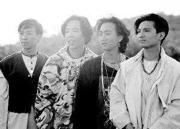

昨日是黄家驹(右二)去世20周年祭日，黄家强(左一)、黄贯中(左二)、叶世荣(右一)各自怀念。

信息时报讯 二十年前的昨天，歌手黄家驹从高台一跌，从此与无数乐迷永别。虽然Beyond另外三子这些年常有矛盾传出，最终导致无官方纪念活动，但在黄家驹20周年祭时，黄家强、黄贯中、叶世荣三人还是发微博共话兄弟情。

既是乐队好拍档，又是黄家驹的弟弟，黄家强拥有双重身份，思念之情也是加倍的。20年来，黄家强从黄毛小子已变成现在的两个孩子的爸爸，已有幸福家庭的他却说现在不是20年来最开心的，“现在是幸福的，但还是阿哥在我身边时最开心，现在少了一个倾诉对象。”黄家强表示黄家驹的人生态度就是自己人生的座右铭，昨日他写下：“无论是昨天、今天、明天，无论是十年、二十年、三十年，只要是我有生之年，黄家驹这个名字，永远都不会让人遗忘，二哥你已经是我的信仰和信念。”

算是三子中发展最好的黄贯中，昨日凌晨在微博写下：“二十年了，很多人还没有知道我们失去了多么重要的他。他不是李小龙，是黄家驹，兄弟走好！”黄贯中接受香港媒体采访时表示黄家驹对自己影响最大的是实力，并透露黄家驹一晚能够创作十几首歌，“我以他为偶像和目标”。

叶世荣虽然仅在微博写下“家驹祝福你”短短几个字，但他日前还重返昔日Beyond的录音室，重拾与黄家驹在一起的回忆。 东东
