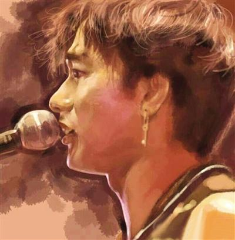

20th

今年6月30日，是黄家驹逝世二十周年的日子，许多乐迷微博悼念追怀黄家驹在时、有Beyond音乐陪伴的日子。黄家驹去世后，Beyond的另外三子虽然渐生嫌隙，但在其二十周年祭日还是发微博共话兄弟情。

二十年前，黄家驹从高台一跌，在无数乐迷的世界里从此不再海阔天空，尤其对黄家驹的弟弟黄家强来说，失去了队友，同时痛失至亲，两兄弟从此天人永别。时至今日，黄家强悲伤未减，每听起“驹歌”的时候都会触动深处神经，每年到了这个愁人时分，黄家强称只会闭关悼念亲兄，更道出黄家驹鲜为人知的种种轶事，逝者已矣，黄家驹的精神其实一直永存大家心中。

## 爆兄长爱睡常迟到

黄家强忆述那些年与哥哥的种种琐事，一事一句，点滴在心头：“他喜欢群体活动，好喜欢去大屿山长沙游水烧东西吃，又组团去泰国玩，女朋友都有一齐去，带上吉他唱歌。” 黄家驹被不少粉丝“神话化”，黄家强却揭露他迟到的坏习惯：“他好爱睡觉，永远都是最迟到，但有次约他早一个小时，竟然准时，骂我们三个。之后我们讲好迟到要罚钱，有次迟一个小时罚他100块，他来不了的话，就扔下100块。还试过去日本发展的会后迟到，被日本那边骂他。”

终究每个出色音乐人都有一点艺术家脾气，黄家强又指哥哥曾试过“躁底”骂粉丝：“有粉丝围着车走不了，他伸头出来骂他们散开。”虽然我行我素，有时都要屈服 于现实之下，最后唯有诉诸音乐，黄家强说：“无可避免要出席一些给面子的派对，例如去别人的生日会唱歌，经理人叫我们去就去啊，他听到我呻又会跟我一齐 嘈，之后就写了一首《俾面派对》，用自己的方法去表达不满。”

昔日年少气盛的黄家强也有任性、耍脾气的一面，不过黄家驹往往帮他打圆场，不加指摘，仿佛一切尽在不言中：“试过为迎合市场，每天都要唱一些流行曲，唱来唱去就那三首，有次我好生气，活动期间走了出去。之后回来哥哥在台上说‘他病好啦，回来啦’，他知道我不高兴，无谓再说我，希望我没事。”

## 黄贯中赞天生领导者

前Beyond成员黄贯中谈起跟已故黄家驹的首次见面时，给他的印象是其“奇怪”的外表，黄贯中说：“啊，为什么这个人那么油啊（满面油光），为什么他会戴副红色框的眼镜呢？”不过 经过相处后，发觉黄家驹有内在美，是天生的领导者，不会随波逐流，既聪明又有主见，最难得是知人善任。

话说当年黄家驹创作了新歌《大地》，请得刘卓辉填词，虽然明知歌曲必大热，但黄家驹却亲自邀黄贯中主唱，黄贯中表示：“我那时候推了啦，跟他讲我只会弹吉他，但是黄家驹说这首歌好合适我，叫我试一下，我就唱啊，原来那时候黄家驹觉得Beyond需要改变，要换一下主音才有新鲜感。”

## 叶世荣常梦会故友

而另一成员叶世荣则说家驹虽已离世20年，但故友仍长留于他脑海中：“我都有梦见家驹，多数都是以前一起的片段，但跟他谈过什么，睡醒就不记得了。”信佛的世荣希望黄家驹惜缘，如再世为人或去到西方极乐世界，最重要“活”得开心。

“神化”争议

黄家强与黄贯中的骂战最终以黄贯中在微博送上祝福而收场，但黄家驹祭日在即，著名乐评人王小峰的一篇名为《Beyond：撒了一点人文作料的心灵鸡汤》的文章再次引起乐评人和歌迷的口水仗。对此Beyond前经纪人陈健添回应说，黄家驹的音乐才华是无可置疑的，一个歌手被神化的现象不是单方面的，跟社会的气候和乐坛的气候是相连的。陈健添认为黄家驹只是一个普通人，不平凡的地方就是拥有超乎寻常的音乐细胞和永不言败的决心，而他能够成功的很大原因是做到了人和音乐的合一。

而曾为Beyond创作《大地》、《岁月无声》等名曲的刘卓辉就表示，王小峰有这样写的权利，但在6月份这样写，就显得太过故意。刘卓辉举例黄家驹当年从肯尼亚回来后就写出《光辉岁月》、《Amani》这样的传世名曲，“除了天才，还能说什么”。

此外，香港文化人廖伟棠也在反驳文章中阐释——早期到中期的Beyond的确很天真，他们的反叛情绪大多泛泛，但刘卓辉执笔的一系列词作如《大地》、《岁月无声》等都是寄寓颇深的杰作。黄家驹也在这种影响下写出了《海阔天空》等较以前成熟的作品，因此晚期的Beyond出现了突破，上述歌曲已经断断不能以鸡汤看之。
