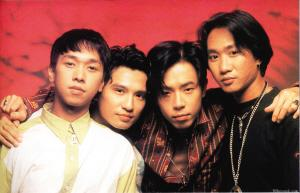

1993年6月30日，歌手黄家驹从舞台堕下身亡，永远离开了热爱他的歌迷。时至今日，Beyond三子悲伤未减，其弟黄家强近日在香港连唱两场纪念家驹，还在北京举行“我会好好的”歌迷见面会，用自己的新歌表达对哥哥的思念之情，并演唱了Beyond的经典作品。黄贯中与叶世荣也以自己的方式悼念伙伴。

20年来，黄家强在哥哥的忌日选择闭关，“我不上街、不工作、不想有任何举动，默默在家里想念他，我太太都知道的。我担心听到旧歌，听到他的声音，情绪波动好大，好挂念他，尤其听他唱《情人》《谁伴我闯荡》等一些慢歌感触更大一点。不过那两晚音乐会唱他的歌，我有忍住。” 他还在微博上发文称：“无论是昨天、今天、明天，无论是10年、20年、30年，只要是我有生之年，黄家驹这个名字，永远都不会让人遗忘，二哥你已是我的信仰，我相信你，永远怀念你！”黄家强希望能与乐迷集体怀念哥哥，完成自己未了的心事，“约翰·列侬的老婆都帮老公搞纪念馆，亲人去做这些事是很自然的，我不管别人怎么看，不想每年做的事都一样。”

Beyond三子最后一次同台是8年前，然而三人如今连聚在一起都希望渺茫。对此，黄家强不愿多做解释，他认为这一切全是因为家驹不在了：“他是我们的灵魂。他知道我们想什么的，如果他知道三个人这样的局面，不如不要去搞，拉拉扯扯，没意义。”但黄家强也安慰歌迷说，一切皆有希望：“凡事都应该向积极的一面去想。”

三人虽然无法同台，但黄贯中、叶世荣也以自己的方式表达了对家驹的怀念。提到跟家驹首次见面的情景，黄贯中印象最深的是其“奇怪”的外表，“当时想，为什么这个人那么油啊（满面油光），为什么他会戴红色框的眼镜呢？”不过，经过相处发觉黄家驹有内在美，是天生的领导者，不会随波逐流，既聪明又有主见，最难得是知人善任。鼓手叶世荣则说家驹仍长留于他脑海中：“我都有梦见家驹，多数都是以前在一起的片段，但跟他谈过什么，睡醒就不记得了。希望他在另一个世界活得开心。
