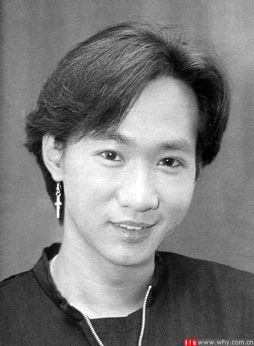
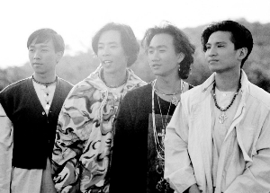

黄家强在微博贴出的黄家驹画像

6月29日，黄家强内地歌迷见面会在京举行，在Beyond成军30周年、黄家驹逝世20周年之际，此行无疑带着怀念与纪念的意味

昨日是黄家驹离世20周年祭日。虽然近年来Beyond三子屡传不和，但在这一天，三子依然不忘曾经共同奋战的好兄弟，纷纷发微博追怀。

1993年6月24日，黄家驹在日本参加综艺节目期间发生意外，坠落舞台受伤，六天后于6月30日离开人世，终年31岁。在黄家驹离世二十周年的祭日，Beyond三子纷纷发微博追怀。鼓手叶世荣率先于6月29日下午为黄家驹点亮一盏蜡烛，“家驹祝福你”几字虽短，但已满载深情厚谊。昨日凌晨00:58，作为黄家驹的弟弟、又曾被黄贯中指责挥霍哥哥财产的黄家强也发微博，称二哥是自己的信仰和信念，并附上一幅黄家驹的侧面画像，文字里写道：“无论是昨天、今天、明天，无论是十年、二十年、三十年，只要是我有生之年，黄家驹这个名字，永远都不会让人遗忘，二哥你已经是我的信仰和信念，我相信你，就好比上帝给予世人的指示，永远怀念你！这画像我很喜欢，希望原创人不要介意我不问自取。”两分钟后，黄贯中在微博中感慨称，很多人到现在还未发觉失去的黄家驹多么重要：“二十年了，很多人还没有知道我们失去了多么重要的他。他不是李小龙，是黄家驹，兄弟走好！”
