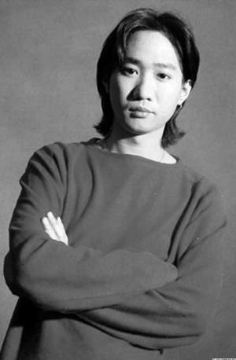

1993年6月24日，31岁的黄家驹因从舞台意外一跌，头部着地导致重伤昏迷，于同年6月30日去世，令当时如日中天的Beyond乐队失去灵魂人物，亦令整个乐坛痛失音乐才子。时光如梭，一晃已经过去了整整20年，尽管Beyond三子尤其是黄家强和黄贯中如今关系堪称“冰点”，但三人在昨天这个日子还是集体通过微博悼念兄弟黄家驹，歌迷们也以各自的方式怀念偶像。令很多歌迷伤感的是，没有了黄家驹的Beyond走到了分崩离析的田地，日前黄家强采访时表示，正因为家驹不在，所以这支曾经辉煌的乐队今后很难再同台。

三人之中，最低调的叶世荣在29日便先在微博上悼念黄家驹。昨天凌晨1时左右，几乎在同一时刻，黄家强和黄贯中不约而同发微博怀念兄弟。亲弟弟黄家强贴上一张不知出处的黄家驹画像，写道：“无论是昨天、今天、明天，无论是十年、二十年、三十年，只要在我有生之年，黄家驹这个名字，永远都不会让人遗忘，二哥你已经是我的信仰和信念，我相信你!永远怀念你！”黄贯中的微博虽然简短但同样深情：“二十年了，很多人还没有知道我们失去了多么重要的他。他不是李小龙，是黄家驹，兄弟走好！”

黄家驹虽然离世20年，可黄贯中、黄家强、叶世荣心中对他的回忆，却还清晰如昨日。谈及跟黄家驹首次见面，黄贯中表示他给自己的印象是奇怪的外表：“为什么这个人那么油啊（满面油光），为什么他会戴副红色框的眼镜呢？”不过相处后，他发觉黄家驹是天生的领导者，既聪明又有主见，最难得的是知人善任。在黄家强的回忆里，哥哥很合群，自己年少气盛爱耍脾气，往往是哥哥帮他打圆场：“当时为迎合市场，每天都要唱一些流行曲，唱来唱去都就那几首，有次我好生气，活动期间走了出去。回来时，哥哥在台上说‘他病好啦，回来啦’。”

6月29日，黄家强在北京举行“我会好好的”歌迷会，用新歌《好好》表达对哥哥的思念之情，并且演唱了Beyond的经典作品。成军30年，Beyond在2005年宣布解散，铁杆歌迷一直盼望Beyond能再复合，然而等来的却是黄家强和黄贯中在微博上掀起骂战。黄家强表示，这些都是小插曲，已经过去,“我是他的亲弟弟，我怀念他是很正常的，其他人怀念家驹也是很正常的。出现这个状况，真是出乎我意料之外。人生的路不可能平淡到一点事情都不发生，我觉得这些都是我们做人应该要承受的，要学习的一些经历。”黄家强回忆说，Beyond三子最后一次同台是2005年，一起去流浪曾经是他们共同的愿望，然而如今三人连同台都希望渺茫：“今年如果能够一起做一个Beyond的演唱会是非常好的，不能做当然有一点遗憾，但是我不勉强，我觉得走在一起，如果不能够互动，不能够做得更好，还是分开做自己喜欢的好，这对每一个人都好。” 至于Beyond复合最大的困难，黄家强不愿多做解释，只感慨：“最大的困难就是家驹不在了。”
