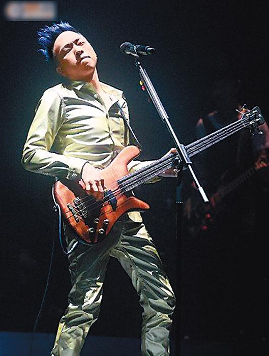

黄家强 资料图片

据香港媒体报道，香港乐队Beyond成员黄家强在兄长黄家驹逝世20周年之际，狠评香港乐坛群龙无首，当红歌手空有好声音但是没有音乐才华，正应验了黄家驹当年一句“香港没有乐坛，只有娱乐圈”。

黄家强前日在电台访问中，对黄家驹尽诉心声说：“哥哥，我已经成长了，你不用再担心我。今天我很好，很想你知道。”当年黄家驹曾有一句名言“香港没有乐坛，只有娱乐圈”，黄家强藉此炮轰现今香港乐坛：“领导香港的那一两个歌手，都不是音乐人，只有好声音，不会唱歌不会弹琴，怎么领导乐坛？某某一开演唱会就满座，歌迷不听其他歌手的歌，音乐圈变得很窄。”

黄家强还怀疑在5年前一个以慈善名义举办的纪念活动中善款被挪用：“5年前捐出去不多，那么大笔钱用去哪里了？我真的有保留，不如自己默默纪念，不想欺骗观众。”

## 周柏豪留言悼念摆乌龙

前日，来自两岸三地以及日本、菲律宾等地的乐迷冒着酷热天气，到黄家驹墓前拜祭，其中一名广州粉丝为偶像剪发，剪成“Beyond”字样，也有乐迷专程带上纸扎吉他祭拜偶像。有团体在铜锣湾行人专用区，在黄家驹死亡时间4时15分，合唱《海阔天空》等金曲，逾百途人和唱兼高举和平手势，齐向家驹致敬。

不过，在社交网站Instagram悼念黄家驹的歌手周柏豪，却大摆乌龙将死忌当生忌，留言祝家驹“生辰快乐”，结果被乐迷愤怒指责。
