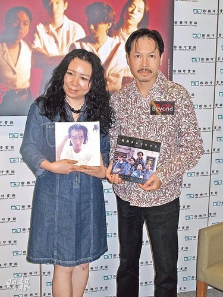

图片来源：香港《明报》

中新网7月13日电

据香港《明报》消息，Beyond前经纪人陈健添昨日举行新书《真的Beyond历史》及《追忆黄家驹》发布会，他透露写真集有大量从未曝光的照片，附送的CD亦是未发表过的Demo，甚有纪念价值。对于有传黄家强接受内地访问时指他“消费死人”，陈健添说：“这样讲好难听，一年几前已决定出书，一直透过电邮通知3位成员，并想将版税捐出去”他表示一直等不到家强回复。

陈健添说：“我真的很愤怒，几间大型慈善机构都不敢收捐款，为何要将好事搞到复杂又丑陋？我最后决定先收取版税，再视乎如何分配给几间慈善机构。”

问到为何与家强势成水火？陈健添说：“以往对4位成员一视同仁，但我曾拒绝家驹要求让家强主唱《阿拉伯跳舞女郎》，相信因此种下祸根。其实大家很多年没见面，日前在叶世荣的演唱会，我与世荣及黄贯中都有聊天，将来若有机会见到家强，我都想跟他聊几句，但不知他会否理我。”

主持人陈海琪提起近日家强与黄贯中隔空骂战，陈健添认为乐队闹不和拆伙是很普遍的事。“家驹离开Beyond是悲剧， 黄贯中力斥Beyond并非家强的家族生意，我听到这一句说话都震撼，黄贯中为人率直，我认为当中有人挑拨离间。”

记者就陈健添的指控联络黄家强，其助手表示家强不在香港，暂未有响应。
