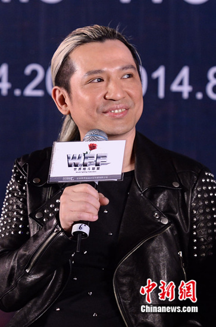
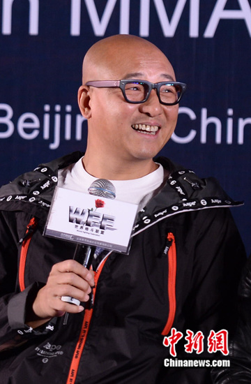

叶世荣

中新网北京4月20日电

近些年，前Beyond成员叶世荣鲜少公开露面，今日下午他意外亮相北京。回忆起当年乐队的演出情景，他透露作为乐队的鼓手，每次演唱会时都要打三个小时鼓，体力消耗特别大，所以演出前就会跑步锻炼体力。

今日下午，“WFF暨首届泛太平洋女子MMA大奖赛(女子格斗)”发布会在北京举办，歌手叶世荣、周晓鸥、天堂乐队及远途乐队应邀出席。据了解，在即将到来的比赛中，他们将联合其他歌手串联演出。

提到对“女子格斗”的了解，前Beyond成员叶世荣表示，这类型比赛能让观众“有兴奋的感受”，“而且我特别敬佩她们训练的时候能吃苦，跟我们做音乐一样，因为做音乐也要天天排练，两个都有正能量，没有正能量不可能有激情”。

既然这次将把音乐与运动结合，问他是否平时也爱运动？叶世荣听闻，有些不好意思地说：“运动啊，那个比较少，简单一点的就是跑跑步，打打游戏也是一种运动。(格斗呢？)我没这个天分，格斗真的需要训练”。

叶世荣早年因Beyond乐队成名，如今却鲜少出现在公众面前。回忆起当年时光，他对记者说：“我记得那时候每次演唱会我都要打三个小时鼓，体力消耗特别大”。所以，每次演出前他就会跑跑步锻炼体力，“那对身体，对音乐都有帮助”。

周晓鸥

