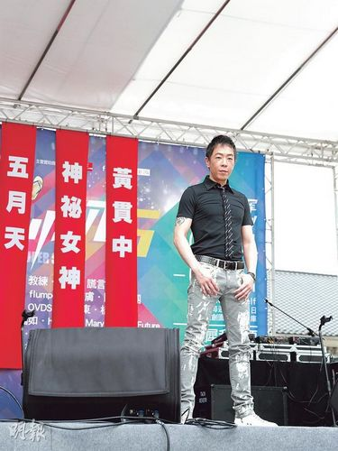

图片来源：香港“明报”

中新网5月12日电

据香港“明报”消息，黄贯中昨日到台湾出席演唱会记者会，他表示早前在微博控诉父亲拿刀砍母亲、打朱茵的家暴事件，只是一时冲动，他已向父亲道歉，父子已和好。黄贯中说：“我承认写得太冲动，但从不后悔，因为家家有本难念的经，现在与父亲有沟通和吃饭见面。”

黄贯中与朱茵结婚两年，并育有女儿黄莺(Debbie)，他否认想追生第二胎，朱茵也无怀孕，他昨日未能陪伴太太共度母亲节，但准备回到港后带妻女到郊外走走、看动物庆祝。
