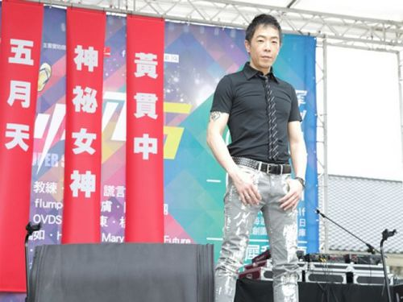

图片来源：台湾“今日新闻网”

中新网5月12日电

据台湾“今日新闻网”报道，香港歌手黄贯中去年11月在微博发文曝出家暴丑闻，控诉父亲拿刀砍母亲、打老婆朱茵，并扬言要“杀父”。昨天(11日)黄贯中出席某记者会时，被问起此事，他说：“我很冲动写在微博，那是我发泄的渠道。”坦言和父亲有不愉快，但一直在沟通中，目前已朝向良性互动。

黄贯中去年在微博中发文，痛斥爸爸：“如果你年事不高，我早就揍你一顿了，要是你敢再令我家人难受的话，我会手刃你，我体内有一半是你的基因，我叫它们为垃圾基因。若你想再打我老母，我老婆，我怕自己会变自己的杀父仇人。”日前又有杂志爆料，他为与老婆朱茵生第二胎，不准爸爸到他家。记者会上，他表示已向父亲道歉，父子和好，无奈地表示都是媒体加油添醋，未曾求证于他。

昨天，由于到台湾参加记者会，黄贯中未与朱茵过母亲节，“在这里跟老婆和小孩说声对不起！希望女儿可以明白爸爸要玩音乐，所以母亲节要往后一点补过。”谈起1岁多的女儿黄莺，他脸上满是甜蜜表情，透露女儿和他一样爱看美女主播报新闻，模仿妈妈打扮，遗传了朱茵爱漂亮的个性。

