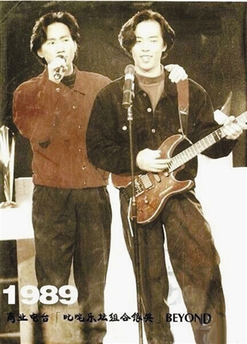

据香港媒体报道，6月10日是香港殿堂级摇滚乐队Beyond主音黄家驹的52岁生忌，同属Beyond成员叶世荣和黄贯中(Paul)，都透过微博对黄家驹表示了怀念。

叶世荣留言表示：“家驹生日快乐，开开心心。”他还送上几个生日蛋糕的表情。

而黄贯中亦贴上了与黄家驹的合照，留言道：“我还记得我们四个人互相鼓励说：‘我们要以拿到最多银奖为目标，因这要比夺金的更难啊！哈哈？’自从你走后，你的音乐从未停过，你比20年前的你更真实，更坚韧地活着，生日快乐，万寿无彊！”

而不少Beyond的粉丝亦于二人的帖文留言悼念。
