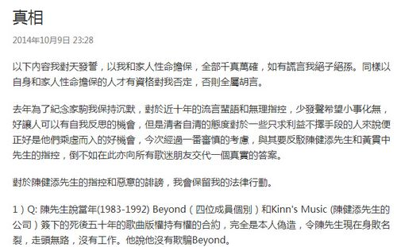

黄家强长文《真相》部分截图

中新网10月11日电

据香港“明报”消息，黄家强与Beyond乐队前经理人陈健添(Leslie)及黄贯中(Paul)素有积怨，近日他被陈健添及疑是黄贯中微博粉丝连环追击。前晚他终于爆发，在微博撰写5000多字长文反驳指控，更爆料当年黄贯中因嫌弃叶世荣致Beyond拆伙。而大岳娱乐事后发声明力挺家强，表示已将诽谤言论及证据交予律师处理，会从法律途径还黄家强一个清白和公道。而Leslie要求家强收回有关言论，自言一定会认真回应的，绝不会草草了事。

对于黄家强爆料事宜，有记者联系上正忙于准备在贵阳市演出的叶世荣，他表示这个月穿梭内地各城市演出，工作非常忙碌，不理会是非。而黄家强、黄贯中及其经理人暂未有回复。

黄家强在题为“真相”的长文中，一开篇就以自己及家人的性命作担保，强调所写句句真话，更发毒誓说如有大话就“绝子绝孙”。文中他力数黄贯中(Paul)不懂尊重、忘恩负义、讲大话、抹黑自己等多宗罪，更爆料Beyond三人在1999年决定分开发展的原因是黄贯中嫌弃鼓手叶世荣。

黄家强写道﹕“黄贯中亲口对我说不想再养世荣了，我好惊讶，何出此言，他说他付出得太多，平均分我们的收入对他不公平，所以他要个人发展，首先；我不认为我和世荣没有付出，这是他的说法，虽我对这个解散或分开的理由不认同，但没有选择之下只好接受，这些伤透心的话我埋藏了15年，从没公开这真正的解散原因，只说音乐上有分歧来维护他，也没有对世荣说过，如今世荣也与佛结缘，看透人生，懂得宽恕了吧！对不起，世荣，希望你也宽恕我，一直没告诉你。”

他还称2005年提议三人合力为Beyond告别演唱会写首以“Beyond的故事”为主题的歌，但黄贯中独自完成，更视他和叶世荣为伴奏乐手，让他们打鼓弹低音吉他就可以，毫不尊重人。之后这首歌被他与叶世荣否决，他称黄贯中就怀恨在心，在告别演唱会上采取不合作态度，至去年更扭曲事实说是黄家强不准许他发表。

黄家强强调他们三人都是在黄家驹的光环下继续追寻理想，但黄贯中自Beyond三人时代开始已对黄家驹情义不再，更指Beyond在黄家驹死后的6年里没使用过黄家驹遗作，是因黄贯中不批准。他说﹕“请他不要忘记这支乐队是黄家驹的……我们在家驹的光环下可以继续追寻理想，他怎可以忘记得一干二净。”

此外，谈及“打助手”，黄家强说﹕“这个助手整整一年换回乡证骗了我4次也换不到，突然要我亲自去中旅社，因第二天要回内地，证已经过期，我就象征性得打了他一下，根本不痛不痒，再推开他去窗口办手续。之后当我知道他和女友住了在我studio(工作室)大半年，我真的忍无可忍才把他辞掉，把他辞退后才发现他偷了我的bass(低音吉他)拿去变卖，这些我当是走霉运，只告诉黄贯中一人知，我当他是朋友，无所不谈，大家可以笑一笑，(最后)竟然变了黑材料，真的令我意想不到。”
