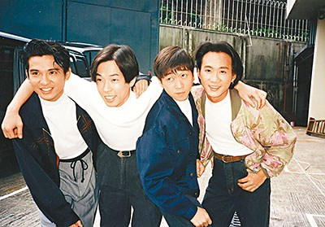

据台湾文汇报报道，香港乐队Beyond前成员黄家强昨日宣布告别微博，并发表题为《真相》的长文，提及Beyond解散的真正原因是黄贯中有感成员收入不均，自己又付出太多，更曾表示“不想再养叶世荣”，因此提出要个人发展。

黄家强表示，此前为了纪念哥哥黄家驹一直保持沉默，对于近十年的流言蜚语和无理指控未作回应，此次决定要反驳前成员黄贯中及前经纪人陈健添的指控，向所有歌迷朋友交代一个真实的答案。

黄家强在文中说明了当年与前经理人陈健添的合约纠纷，以及陈在双方决裂后利用Beyond赚钱的事件始末，并澄清黄家驹生前就已经与林楚麒分手，斥林利用黄家驹未亡人身份炒作。

黄家强还提及Beyond解散的真正原因是黄贯中有感成员收入不均，自己又付出太多，更曾表示“不想再养叶世荣”，因此提出要个人发展。黄家强又提到世荣并不知道Beyond解散的原因，他也需向世荣道歉。

黄家强的经理人公司大岳娱乐随后亦发出声明，称对家强发出的长微博澄清事件作全力支持。
