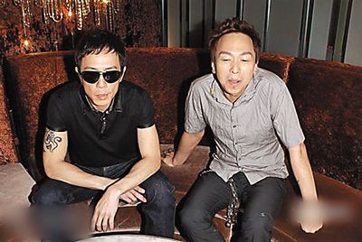
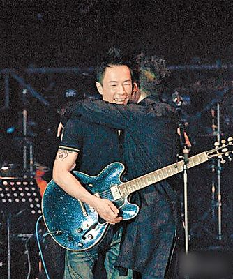

曾经拥抱和解的两人如今彻底闹翻

前晚，Beyond乐队贝斯手、黄家驹的弟弟黄家强在微博发表了一篇题为《真相》的文章。针对前经纪人陈健添和黄贯中此前对他的指控，黄家强声称要向所有歌迷“交代一个真实的答案”。他还表示将从此告别微博。

自黄家驹去世后，Beyond余下三子只维持了短暂的友好期，之后很快就拆伙。黄家强和黄贯中一直闹不和，这一回黄家强放出“终极大招”，与黄贯中的矛盾看来是没有弥补的可能了。其中谁对谁错，外人都是雾里看花，唯一肯定的是Beyond重组无望，令许多粉丝伤透了心。

黄家强这篇《真相》文章很长，要点如下：

1.  当年Beyond解约的真正原因并非公开宣称的“音乐上有分歧”，而是由于黄贯中不满收入平均分配，他亲口对黄家强说“不想再养(叶)世荣”。
1.  黄贯中不顾黄家强和叶世荣的感受，创作纪念黄家驹的歌曲也不问他们的意见，只把他们当伴奏乐手。
1.  黄家强与黄贯中闹翻后又和好，后来因为黄贯中不满巡演中自己唱得太少而再度闹翻。
1.  黄贯中和香港记者闹翻，黄家强非但没有落井下石，还暗中调停。
1.  前经纪人陈健添骗Beyond签下不平等合约，包括持有Beyond死后50年歌曲版权(当时黄家驹仍在世)。事实上，Beyond所有成员都对陈健添不满，黄贯中还叫陈健添“吸屎鱼”。
1.  陈健添批评黄家强冤枉黄家驹的女友林楚麒，但实情是林欺骗了黄家驹，两人早已分手。而黄家驹去世前，他的正牌女友是简小姐。林说自己是黄家驹的“未亡人”，其实是炒作。

对于这篇文章，Beyond前经纪人陈健添前晚更新微博回应称：“黄家强《真相》一文已细阅……发觉部分内容有不少漏洞，你需不需要先收回去，重新处理好后，再让我回应？那么，我今晚先看看电视，假如明天没有收到你新的《真相》，我定会按目前这个版本给你一个公道回应。”但其后未见到他有新的回应。此外，黄贯中暂时没有回应。而近年已信佛的叶世荣则表示不想再纠缠旧事。

黄家强和黄贯中都是1964年出生，叶世荣1963年出生，因此有网友感叹，大家都50岁的人了，何必呢？而作为歌迷，只是想再听到他们合唱一次《海阔天空》……
