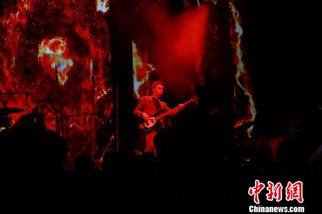
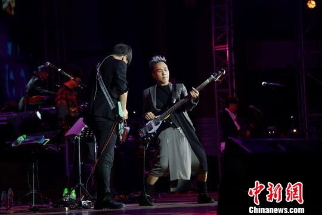

黄家强时代序曲演唱会现场。 江安东 摄

黄家强时代序曲演唱会现场。 江安东 摄

10月12日晚，黄家强时代序曲演唱会奏响山城，唤醒80后青春记忆，再次热追Beyond乐队宣扬的“大爱”精神。Beyond是中国香港殿堂级摇滚乐队，其歌曲和传递的精神曾影响了一代人，外界评价“Beyond不止是一支乐队，它象征着我们的岁月，也象征着香港歌坛。”黄家强是Beyond乐队的贝斯手，也是其乐队的已故主唱兼吉他手黄家驹的弟弟。
