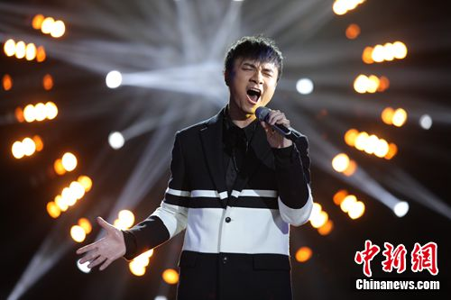
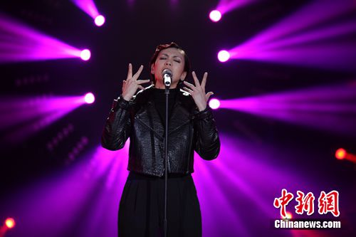
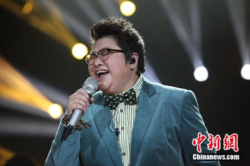
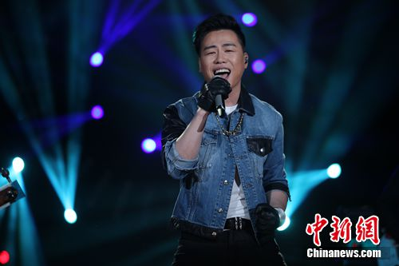
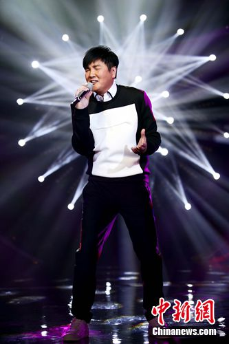
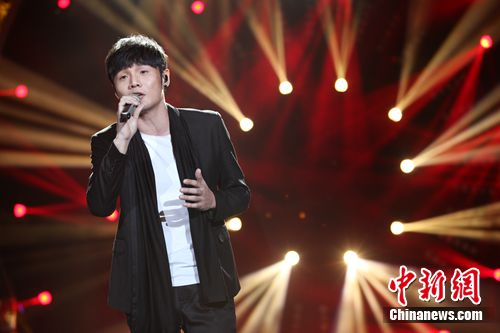

古巨基

中新网长沙1月15日电

《我是歌手》第三季正在湖南卫视热播，新一期节目中，古巨基演唱了Beyond的《情人》，并表示要将观众的掌声献给他们；上一期中获得第一的张靓颖，演唱了朴树代表作《生如夏花》，并以一身长裙搭配铃铛配饰登台。

15日，湖南卫视《我是歌手》第三季在长沙举办第三期节目媒体看片会。节目中，歌手及踢馆歌手纷纷动情演唱，多次将现场气氛推至高潮。

## 古巨基致敬Beyond

前两期节目中，古巨基分别以《爱与诚》、《父亲》引发关注。新一期节目中，他将演唱Beyond的歌曲《情人》，并在演唱结束后坦言：“《情人》是黄家驹离开后，我自己听得最多的一首，也在这里借大家的掌声送给Beyond。”观众则起立鼓掌，并用粤语夸赞古巨基“好厉害”。

作为歌坛经验丰富的“老大姐”，韩红在上一期节目中演唱了《梨花又开放》，并透露这首歌充满着她与奶奶的回忆。在新一期节目中，她一改选曲风格，演唱了齐秦的《往事随风》，而在其精湛的演唱下，现场观众纷纷沉浸在音乐中，并给予其热烈掌声。

孙楠则演唱了经典歌曲《至少还有你》，尽管这首歌已经被很多人翻唱过，但孙楠通过更明快的编曲，将歌曲演绎出了不同的味道，也引发现场观众合唱。而A-Lin则以动感十足的《找自己》将现场气氛推至高潮，古巨基更表示在台下会随着节奏一起动。

## 张靓颖登台满身铃铛

在上一期节目中获得第一的张靓颖，本期将演唱朴树代表作《生如夏花》。除了精湛演唱功力再次获得观众好评外，其蓝白长裙搭配铃铛配饰的造型也相当亮眼，古巨基更表示被张靓颖“骗了”，“之前她告诉我要在铃铛下面也放上话筒，结果根本就不是。铃铛只是装饰而已。”

此外，胡彦斌则演唱了由童安格作词作曲的《耶利亚女郎》，变换的鼓点和流畅的演唱，让现场观众随之手舞足蹈，更获得观众掌声。

新加坡歌手陈洁仪的离场曾引发热议，而新一期节目中，她将返场演唱《Nothing Compares to You》，悠扬深情的演唱让现场观众再次沉浸在她专注的歌声中。

此外，作为最受关注的踢馆歌手，台湾新声歌手李荣浩的亮相更引发现场欢呼。古巨基更在介绍他时瞪大眼睛，以示其在音乐方面的才华和力量之大。而李荣浩也以一曲《模特》获得观众掌声。

据悉，《我是歌手》第三季第三期节目将于16日22：00在湖南卫视播出。

A-Lin

陈洁仪

韩红

胡彦斌

孙楠

张靓颖

李荣浩
