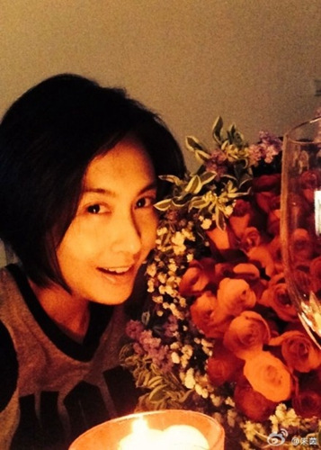

图片来源：朱茵微博

据香港媒体报道，被喻为香港乐坛摇滚教父的黄贯中(Paul)火爆性格无人不知。不过，自2012年与拍拖多年的女神朱茵奉女成婚后，Paul的暴躁个性明显有所改善。早前，媒体于九龙城发现他带着老婆及萌娃女儿到茶餐厅饮下午茶，席间，女儿黄莺纵然不断多动，Paul也面不改色好言相向，更发挥好爸爸的耐心本色，又抱又哄又说教。而昔日的性感女神朱茵也极为低调变成好妈妈，女儿饿肚子，朱茵立刻拿出奶瓶当街喂奶。

自12年十月，九十年代性感女神朱茵为黄贯中诞下女儿黄莺后，便鲜少公开亮相。纵然前几个月她签约新的经纪公司开拓内地市场，但作风依然低调。早前，媒体于九龙城发现黄贯中带着朱茵及女儿到茶餐厅饮下午茶，两夫妻戴着情侣鸭舌帽，选择了靠墙的座位，一直盛传再怀二胎的朱茵，穿着宽松装，猛看身形臃肿，另外，该媒体也拍到他们秘密添置家具，更令传言疑似变真。

黄贯中一家三口与佣人急速喝完下午茶后，便结账离开。不过，两岁半胖嘟嘟的黄莺不止遗传了父亲的音乐细胞，喜欢闻歌起舞，还似父亲一样有个性，不时在座位上扭动叫喊。本来，黄贯中先到柜台买单，但听见女儿的呼唤后，便马上返回抱起女儿，可惜女儿没有妥协，还意图从父亲的怀中挣脱离开，令原本欲低调的朱茵颇为尴尬。
