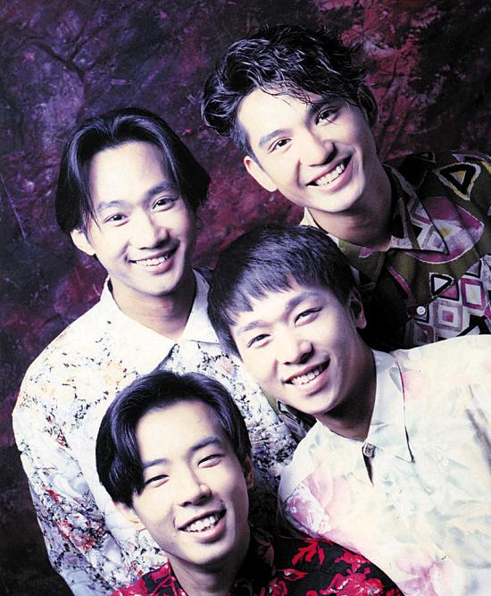

昔日团队合作无间

昨天是Beyond乐队前主唱黄家驹的53岁冥诞，Beyond成员叶世荣、黄贯中、黄家强各自以不同形式纪念好友。不过之前被问及三子有无可能重组时，黄家驹胞弟黄家强坚称，与黄贯中不可能再合作、甚至是见面，Beyond三子已经缘尽，不可能再合体！

昨天零点，Beyond鼓手叶世荣准时给老友送上生日祝福，称“你的爱心会一直延续下去”。之后黄贯中也在微博怀念黄家驹：“因为你离去的惋惜，更要纪念你来临的可贵，生日快乐！”黄家强则在早前的发布会上称，会到家驹墓前去探望他，“不过我想清静一点去见他，不会带小朋友去。”

据报道，叶世荣此前曾计划今年年底在红馆举行纪念黄家驹的慈善演唱会，撮合已反目的黄家强与黄贯中同台。黄家强早前接受访问时表示会支持叶世荣的计划，但与黄贯中不可能再合作、甚至是见面，Beyond三子已经缘尽，不可能再合体！对于叶世荣欲约三人见面，黄家强决绝地说：“我只会见世荣！我不是怕他(黄贯中)，而是不想再接触！再同台？应该不会，如果还同台，有点虚伪吧！”谈到多年来自己被讽是“六月歌手”、借黄家驹冥诞来炒作和赚钱，黄家强自嘲道：“今年不是周年祭，我不会质疑世荣，他是出自真心，而我连在周年搞纪念都被质疑！”

提到有年轻歌手将在下月举办黄家驹纪念演出，黄家强觉得到现在仍有人那么喜欢黄家驹，是种光荣，但对于Beyond三子是否还有机会合体演出，他斩钉截铁地说：“我已经放下，无仇无怨，只是不想再见到他(黄贯中)！如果要一起工作，我会真心去做，不会有提防，但要和他开工，我要防他！”

面对黄家强的攻击，黄贯中未作直接回击，只在微博意有所指地表示：“‘世上没有不可能的事’，这句话同时直接证明了‘世上没有绝对的事’，这是多么令人抓头的一件事。最近常有风雨，各位要小心着凉。”

家驹已然离去多年，而原本如同亲兄弟一般的Beyond如此不欢而散，令歌迷伤心不已。有网友感慨：“海阔天空，但愿Beyond的形象不要因此毁于一旦，乐队给予我们的一直是积极向上的人生态度，催人奋进的呐喊，不要因为这种鸡毛蒜皮的小事撕破脸皮，让人贻笑大方！为了Beyond，为黄家驹！请克制！”

## Beyond三子恩怨史

Beyond曾是香港殿堂级乐队，主唱黄家驹是乐队的灵魂核心。1993年Beyond在东京录制节目时，黄家驹不慎从舞台上跌落身亡。失去了乐队主心骨后，Beyond于2005年宣告解散，三位成员更屡传不和。

## 早年，因理念和女人反目

Beyond成立20周年之际，三子曾一度以乐队形式复出举行演唱会，但黄家强和黄贯中传出不和，据悉两人因音乐理念及演唱曲目发生争执，致使原定的马来西亚演唱会被迫取消。

2003年，黄贯中和朱茵去泰国度假，不料走漏风声，媒体拍到朱茵未化妆及身穿三点式泳衣的照片。朱茵放言斥责身边人爆料，矛头直指黄家强，令黄贯中与之反目成仇。两人内讧后，乐坛前辈谭咏麟、单立文等曾劝架，叶世荣也曾提出给双方摆和解酒，却遭黄贯中一口拒绝。

2008年，黄贯中和黄家强一度握手言和，两人还在台上一抱泯恩仇。不过好景不长，因叶世荣经常以Beyond的名义在内地开唱，惹来黄家强和黄贯中的不满。

## 近年，传为收入不均内讧

2013年，48岁的叶世荣完婚，黄家强和黄贯中均未参加婚礼。同年5月，Beyond前经纪人Leslie chan在微博上发表了题为《Beyond30周年的意义》长微博，文中暗指黄家强以黄家驹的名字博宣传，还指黄贯中祭拜黄家驹都在深夜，而黄家强每次祭拜都故意让记者拍照。

此举让两人的矛盾加深，黄贯中在微博展开对撕，“家强，我有什么得罪你，男人老狗，那天和你面对面，你居然对演出及照片只字不提，现在还攻击我，对你的个唱真的有帮助？”

去年6月，黄家强在微博晒出五千字长文的《真相》，提及Beyond解散的真正原因是黄贯中有感成员收入不均，自己又付出太多，更曾表示“不想再养叶世荣”，提出要个人发展，再度令三人的关系降至冰点。
