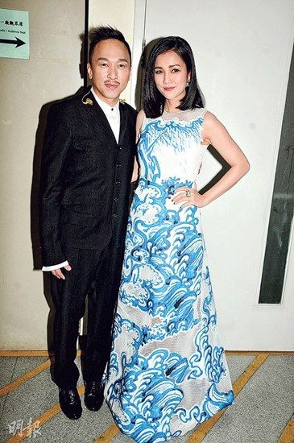

黄家强（左）。 图片来源：香港“明报”

中新网6月29日电

据香港“明报”报道，近日，有消息指Beyond三子未能合体现身黄家驹纪念演出，是因黄贯中妻子朱茵对黄家强仍有成见，且希望与黄贯中去美国做人工受孕。对此，黄家强昨日出席活动时重申，早已说过不做这个演出，其他人有无干预与自己无关，也没去追究。

对于朱茵想再生娃而拒让丈夫演出的传闻，黄家强认为男主外，女主内，应该不关事，希望媒体不要冤枉二人，大家都开心过生活。他强调：“(Beyond)不会一起演出，可惜也没办法，再问也不会有，以后都没有！”黄家强坦言两年前担心过粉丝会失望，但现在已不会再担心不会成功的事，自己帮不到歌迷，歌迷也帮不到他。
